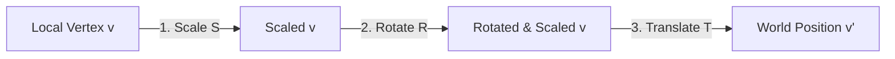
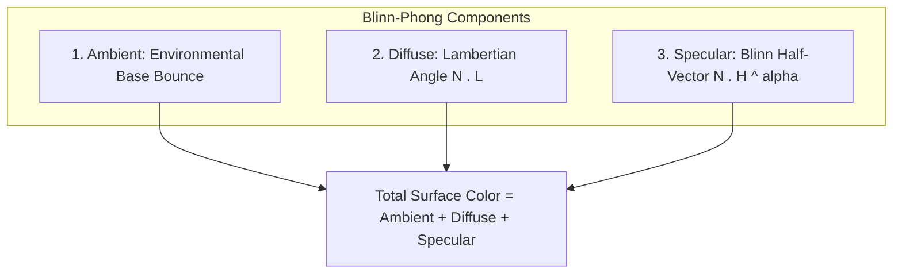

# 🏮 Matsuri Nights — The Comprehensive Codebase Engineering & Theory Guide

> **Project:** *Matsuri Nights — A Japanese Festival Street*  
> **Course:** CSE4102 — Computer Graphics and Image Processing Laboratory  
> **Institution:** Khulna University of Engineering & Technology (KUET)  
> **Author:** MD. Abu Hasanat Soykot (Roll: 2107100, Group: B2)  
> **Language / Standard:** ISO C++20  
> **Graphics API:** Modern OpenGL 3.3 Core Profile (GLFW 3.5.1, GLAD, GLM)  
> **Target Environment:** Microsoft Visual Studio 2022 / MSVC v145 toolset, Windows x64  

---

## Table of Contents
1. [Introduction & Architectural Vision](#1-introduction--architectural-vision)
2. [From Zero to Final Project: Step-by-Step Chronological Evolution](#2-from-zero-to-final-project-step-by-step-chronological-evolution)
   - [Step 0: The Empty Canvas & Project Setup](#step-0-the-empty-canvas--project-setup)
   - [Step 1: GLFW Window Initialization & GLAD Modern OpenGL Context](#step-1-glfw-window-initialization--glad-modern-opengl-context)
   - [Step 2: Core Rendering Primitives — VAO, VBO, EBO, Vertex Layout & GLSL Compilation](#step-2-core-rendering-primitives--vao-vbo-ebo-vertex-layout--glsl-compilation)
   - [Step 3: Virtual Camera System, View Projections & Orthonormalization](#step-3-virtual-camera-system-view-projections--orthonormalization)
   - [Step 4: Spatial Mathematics & The TRS Hierarchical Transform Model](#step-4-spatial-mathematics--the-trs-hierarchical-transform-model)
   - [Step 5: Procedural Geometric Primitives & Analytical Surface Normals](#step-5-procedural-geometric-primitives--analytical-surface-normals)
   - [Step 6: Advanced Differential Geometry — Bézier, Catenary & Bishop Swept Surfaces](#step-6-advanced-differential-geometry--bézier-catenary--bishop-swept-surfaces)
   - [Step 7: The Hierarchical Scene Graph & Dirty-Flag World Matrix Traversal](#step-7-the-hierarchical-scene-graph--dirty-flag-world-matrix-traversal)
   - [Step 8: Optical Illumination — Forward Blinn-Phong Pipeline & Multi-Light Attenuation](#step-8-optical-illumination--forward-blinn-phong-pipeline--multi-light-attenuation)
   - [Step 9: Dynamic Celestial Sky Dome & Day/Night Transition State Machine](#step-9-dynamic-celestial-sky-dome--daynight-transition-state-machine)
   - [Step 10: High-Fidelity Directional Soft Shadow Mapping (PCF & Slope Biasing)](#step-10-high-fidelity-directional-soft-shadow-mapping-pcf--slope-biasing)
   - [Step 11: Pure Procedural Texture Synthesis (24-bit BMP Architecture)](#step-11-pure-procedural-texture-synthesis-24-bit-bmp-architecture)
   - [Step 12: Architectural Modeling — Torii Gate, Machiya Townhouses, Yatai Stalls & Props](#step-12-architectural-modeling--torii-gate-machiya-townhouses-yatai-stalls--props)
   - [Step 13: Kinematics & Hierarchical Animation Engines (Pendulums, Gaits, Orbits, Particles)](#step-13-kinematics--hierarchical-animation-engines)
   - [Step 14: Dual Ray Tracing Architectures (Real-Time GPU Whitted & Multi-Threaded CPU Engine)](#step-14-dual-ray-tracing-architectures)
   - [Step 15: Spatial Collision Detection, Indoor Portals & Navigation Boundaries](#step-15-spatial-collision-detection-indoor-portals--navigation-boundaries)
   - [Step 16: Heads-Up Display (HUD), Monospace Bitmap Atlas & Contextual Interaction](#step-16-heads-up-display-hud-monospace-bitmap-atlas--contextual-interaction)
   - [Step 17: Automated Headless Testing, Verification Suite (312 Assertions) & Batch Screenshot Harness](#step-17-automated-headless-testing-verification-suite)
3. [Core Mathematical Foundations, Derivations & Matrix Formulations](#3-core-mathematical-foundations-derivations--matrix-formulations)
   - [3.1 The Graphics Coordinate Pipeline](#31-the-graphics-coordinate-pipeline)
   - [3.2 Homogeneous Coordinates & The Perspective Divide](#32-homogeneous-coordinates--the-perspective-divide)
   - [3.3 TRS Matrix Composition Order: Proof of $M = T \cdot R_y \cdot R_x \cdot R_z \cdot S$](#33-trs-matrix-composition-order)
   - [3.4 The Normal Matrix: Mathematical Proof of $N = (M^{-1})^T$](#34-the-normal-matrix)
   - [3.5 Gram-Schmidt View Matrix Derivation](#35-gram-schmidt-view-matrix-derivation)
   - [3.6 Perspective Projection Matrix Derivation ($1/z$ Depth Precision)](#36-perspective-projection-matrix-derivation)
   - [3.7 The Blinn-Phong Reflection Model: Lambertian Diffuse & Half-Vector Specular](#37-the-blinn-phong-reflection-model)
   - [3.8 Light Distance Attenuation Mechanics](#38-light-distance-attenuation-mechanics)
   - [3.9 Spotlight Cone Mathematics & Angular Smoothing](#39-spotlight-cone-mathematics)
   - [3.10 Directional Shadow Mapping: Biasing, Peter Panning & 16-Sample PCF Filtering](#310-directional-shadow-mapping)
   - [3.11 Differential Curves: Bézier, Catmull-Rom & Catenary Equations](#311-differential-curves)
   - [3.12 Rotation-Minimizing Frames: Rodrigues' Rotation & Bishop Parallel Transport](#312-rotation-minimizing-frames)
   - [3.13 Ray Tracing Mechanics: Ray Equations, Analytical Intersections & Whitted Recursion](#313-ray-tracing-mechanics)
4. [File-by-File & Block-by-Block Exhaustive Codebase Breakdown](#4-file-by-file--block-by-block-exhaustive-codebase-breakdown)
   - [`Main.cpp`](#file-maincpp)
   - [`src/Camera.h`](#file-srccamerah)
   - [`src/Transform.h`](#file-srctransformh)
   - [`src/Mesh.h`](#file-srcmeshh)
   - [`src/Primitives.h`](#file-srcprimitivesh)
   - [`src/Curves.h`](#file-srccurvesh)
   - [`src/SceneNode.h`](#file-srcscenenodeh)
   - [`src/Light.h`](#file-srclighth)
   - [`src/Shader.h`](#file-srcshaderh)
   - [`src/Texture.h`](#file-srctextureh)
   - [`src/TextureGenerator.h`](#file-srctexturegeneratorh)
   - [`src/Objects.h`](#file-srcobjectsh)
   - [`src/Scene.h`](#file-srcsceneh)
   - [`src/RayTracer.h`](#file-srcraytracerh)
   - [`src/ui/FontAtlasData.h`](#file-srcuifontatlasdatah)
   - [`src/ui/Hud.h` & `src/ui/Hud.cpp`](#file-srcuihudh--srcuihudcpp)
   - [`src/ui/Interactable.h`](#file-srcuiinteractableh)
   - [`src/ui/InteractionManager.h` & `src/ui/InteractionManager.cpp`](#file-srcuiinteractionmanagerh--srcuiinteractionmanagercpp)
   - [`shaders/basic.vert` & `shaders/basic.frag`](#file-shadersbasicvert--shadersbasicfrag)
   - [`shaders/shadow_depth.vert` & `shaders/shadow_depth.frag`](#file-shadersshadow_depthvert--shadersshadow_depthfrag)
   - [`shaders/raytrace.vert` & `shaders/raytrace.frag`](#file-shadersraytracevert--shadersraytracefrag)
   - [`shaders/hud.vert` & `shaders/hud.frag`](#file-shadershudvert--shadershudfrag)
5. [The Complete Scene Graph Architectural Hierarchy](#5-the-complete-scene-graph-architectural-hierarchy)
6. [Dynamic Systems & Kinematic Physics Deep-Dive](#6-dynamic-systems--kinematic-physics-deep-dive)
7. [Collision Detection, Spatial Constraints & Indoor Navigation](#7-collision-detection-spatial-constraints--indoor-navigation)
8. [Automated Verification & Test Suite Architecture (312 Tests)](#8-automated-verification--test-suite-architecture)
9. [Master Reference: Keybindings, Shader Uniforms, Light IDs & Asset Registry](#9-master-reference)

---

# 1. Introduction & Architectural Vision

### What is Matsuri Nights?
**Matsuri Nights — A Japanese Festival Street** is an interactive, real-time 3D computer graphics system developed from first principles using modern C++ (ISO C++20) and Modern OpenGL 3.3 Core Profile. The application renders an authentic cultural festival street scene (*Matsuri*) at twilight and night in historic Japan.

The scene features:
- **Traditional Architecture:** Two-story Japanese townhouses (*Machiya*) with fully walkable interiors, sliding Shoji paper doors, polished cypress corridors, staircases, and second-story Tatami rooms.
- **Sacred Gateway:** A towering *Torii* shrine gate adorned with curved sweeping lintels (*Kasagi*), boundary stone lanterns (*Tōrō*), and hanging red paper lanterns (*Chōchin*).
- **Festival Activity:** Two fully modeled festival food stalls (*Yatai*)—a Takoyaki (octopus ball) stall featuring a sizzling cast-iron griddle, and a Kakigori (shaved ice) stall with a vintage mechanical ice shaver and syrup bottles.
- **Stage Performance:** An elevated wooden magic show stage featuring an articulated magician casting spells with a glowing magic wand, a floating orbiting magical orb, and a vanishing trick box with an animated opening/closing lid.
- **Nature & Ambiance:** Curved weeping cherry blossom trees (*Sakura*) with procedural bark, lush blooming canopies, and real-time fluttering blossom petals drifting down to the street.
- **Crowds & Spectators:** Articulated pedestrians walking down the street with realistic bipedal walking gaits and collision avoidance, alongside seated spectators watching the stage performance.
- **Celestial & Night Atmosphere:** A dynamic sky dome with seamless day/night transitions, a radiant sun with corona bloom, a silvery moon with crater texture and halo, twinkling stars, celestial star dust, overhead hanging lantern strings sagged in hyperbolic catenaries, and periodic fireworks exploding across the sky.

### Why was this project created?
The project was engineered to satisfy and exceed all laboratory requirements of **CSE4102: Computer Graphics and Image Processing Laboratory** at Khulna University of Engineering & Technology (KUET). Beyond basic course requirements, it serves as an educational textbook implementation demonstrating how modern real-time rendering pipelines, differential geometry, physical illumination, hierarchical scene graphs, and hybrid ray tracing work under the hood without relying on black-box commercial game engines (such as Unity or Unreal).

### How is the software structured?
Every layer of the system is built modularly with zero external game engine dependencies. The graphics pipeline is depicted in the diagram below:

```mermaid
flowchart TD
    subgraph Host Application [CPU / C++20 Host Application]
        Main[Main.cpp: Event Loop & Timing] --> Input[Input Callbacks & Mouse Capture]
        Main --> SceneGraph[SceneNode: Hierarchical TRS Update]
        Main --> Animation[Kinematics: Lanterns, Crowds, Magic, Petals, Sky]
        Main --> Collision[Continuous AABB Collision & Doorway Portals]
        Main --> Interaction[InteractionManager: Selection & Live Gizmo]
    end

    subgraph Render Pipeline [GPU Rendering Pipeline - OpenGL 3.3 Core]
        Pass1[Pass 1: Directional Shadow Map FBO (2048x2048)]
        Pass2A[Pass 2A: Forward Shading (Blinn-Phong, 16 Lights, PCF Shadows)]
        Pass2B[Pass 2B: Fullscreen GPU Ray Tracer (Whitted Multipass)]
        Pass3[Pass 3: 2D Orthographic HUD Pass (Font Atlas Batching)]
    end

    subgraph Output [Display & Storage]
        Swap[glfwSwapBuffers: V-Sync Present]
        Capture[stb_image_write: Automated Report Capture & BMP Snapshots]
    end

    Input --> SceneGraph
    SceneGraph --> Pass1
    Animation --> SceneGraph
    Pass1 --> Pass2A
    Pass2A --> Pass3
    Pass2B --> Pass3
    Pass3 --> Swap
    Pass3 --> Capture
```

---

# 2. From Zero to Final Project: Step-by-Step Chronological Evolution

Understanding complex software is easiest when retracing the exact engineering steps taken from an empty directory to the final complete application.


### Step 0: The Empty Canvas & Project Setup
- **What:** Configuring the project configuration files (`.vcxproj`, `.slnx`), directory structures, and linking standard C++20 with MSVC v145.
- **Why:** Modern OpenGL applications require 64-bit architectures, robust standard libraries, and strict type safety.
- **How:** Dependencies were collected under a localized `Libraries/` directory: GLFW 3.5.1 (windowing & OS events), GLAD (OpenGL 3.3 Core profile loader), GLM (OpenGL Mathematics for vectors and matrices), and `stb_image` / `stb_image_write` for image processing. No system-wide environment variables are required.

### Step 1: GLFW Window Initialization & GLAD Modern OpenGL Context
- **What:** Initializing the GLFW library, requesting an OpenGL 3.3 Core Profile context, setting window dimensions to $1280 \times 720$, and mapping OpenGL runtime function pointers via GLAD.
- **Why:** OpenGL is a specification, not a concrete driver library. The operating system does not export modern OpenGL functions (like `glGenVertexArrays` or `glCreateShader`) directly. A windowing library (GLFW) must negotiate with the OS graphics driver to establish a rendering surface, and a loader (GLAD) must query the GPU driver at runtime for function entry points.
- **How:** `glfwInit()` is invoked, followed by `glfwWindowHint(GLFW_CONTEXT_VERSION_MAJOR, 3)`, `glfwWindowHint(GLFW_CONTEXT_VERSION_MINOR, 3)`, and `glfwWindowHint(GLFW_OPENGL_PROFILE, GLFW_OPENGL_CORE_PROFILE)`. Calling `gladLoadGLLoader((GLADloadproc)glfwGetProcAddress)` binds all modern OpenGL function pointers.

### Step 2: Core Rendering Primitives — VAO, VBO, EBO, Vertex Layout & GLSL Compilation
- **What:** Creating the hardware abstraction for geometry: Vertex Array Objects (VAO), Vertex Buffer Objects (VBO), and Element Buffer Objects (EBO), coupled with GLSL vertex and fragment shader compilation.
- **Why:** In Modern OpenGL (Core Profile), the legacy fixed-function pipeline (`glBegin()` / `glEnd()`) is deprecated. All vertex geometry must be uploaded to dedicated VRAM buffers and rendered via programmable GPU shader stages.
- **How:** A unified `Vertex` structure was defined containing 8 floating-point numbers (32 bytes):
  ```cpp
  struct Vertex {
      glm::vec3 Position;  // Offset 0 bytes (layout location 0)
      glm::vec3 Normal;    // Offset 12 bytes (layout location 1)
      glm::vec2 TexCoords; // Offset 24 bytes (layout location 2)
  };
  ```
  `glGenVertexArrays`, `glGenBuffers`, `glBindBuffer(GL_ARRAY_BUFFER, ...)`, and `glBufferData` transfer data from system RAM to VRAM.

### Step 3: Virtual Camera System, View Projections & Orthonormalization
- **What:** Implementing a 6-DOF (degrees of freedom) first-person camera supporting WASDQE keyboard translation, mouse look (yaw/pitch), and mouse wheel FOV zooming.
- **Why:** 3D worlds require projecting arbitrary 3D coordinates into a 2D camera viewport while maintaining correct perspective foreshortening.
- **How:** Pitch is clamped between $-89^\circ$ and $+89^\circ$ to prevent Euler pole singularity inversion. Gram-Schmidt cross products compute the camera's orthonormal basis ($\vec{\text{Right}} = \text{normalize}(\vec{\text{Front}} \times \vec{\text{WorldUp}})$, $\vec{\text{Up}} = \text{normalize}(\vec{\text{Right}} \times \vec{\text{Front}})$). The View matrix is formed by `glm::lookAt`, and the Projection matrix is formed by `glm::perspective(FOV, Aspect, Near, Far)`.

### Step 4: Spatial Mathematics & The TRS Hierarchical Transform Model
- **What:** Designing an object transformation model storing 3D translation ($\vec{T}$), Euler rotation ($\vec{R}$ in degrees), and scale ($\vec{S}$).
- **Why:** Complex scenes require objects to move independently while preserving hierarchical relationships (e.g., a swinging lantern attached to an overhead rope).
- **How:** The local affine matrix is computed via strict matrix multiplication:
  $$M_{\text{local}} = T(\vec{T}) \cdot R_y(\theta_y) \cdot R_x(\theta_x) \cdot R_z(\theta_z) \cdot S(\vec{S})$$
  Dirty-flag caching ensures this matrix is recomputed only when position, rotation, or scale changes.

### Step 5: Procedural Geometric Primitives & Analytical Surface Normals
- **What:** Writing algorithmic generators for 3D geometric primitives: Cube, Cylinder, Cone, Sphere, Plane, Torus, and Prism.
- **Why:** Hand-modeling thousands of polygons in external tools creates dependency bloat. Algorithmic procedural geometry provides exact mathematical surface normals, predictable UV coordinates, and zero external file dependencies.
- **How:** Cylinders and cones use parametric angle loops ($\theta \in [0, 2\pi]$) with distinct wall vertices and cap fans. Spheres use spherical coordinates ($\theta, \phi$) with polar seam stitching. Cubes duplicate vertices across all 6 faces (24 vertices total) so each face has sharp, independent normal vectors preventing unnatural smooth shading over $90^\circ$ edges.

### Step 6: Advanced Differential Geometry — Bézier, Catenary & Bishop Swept Surfaces
- **What:** Creating continuous mathematical 3D curves (Quadratic/Cubic Bézier, Catmull-Rom splines, Hyperbolic Catenary curves) and sweeping 2D profiles along them to generate curved roofs, ropes, and tree branches.
- **Why:** Japanese traditional architecture features sweeping, upward-curving roof eaves (*Kasagi*), hanging ropes naturally sag under gravity, and cherry trees have winding organic trunks. Standard cylinders look rigid and artificial.
- **How:** Hanging ropes evaluate the exact physical catenary formula:
  $$y(x) = a \cosh\left(\frac{x}{a}\right) - a$$
  To sweep a 3D circle along a curve without pinching or twisting, **Bishop Parallel Transport Frames** (Rotation-Minimizing Frames) were implemented using Rodrigues' rotation formula.

### Step 7: The Hierarchical Scene Graph & Dirty-Flag World Matrix Traversal
- **What:** Constructing a multi-level scene graph tree (`SceneNode`) where each node has a parent pointer, a list of child pointers, a local `Transform`, and an optional mesh and material.
- **Why:** Real-world objects move relative to parent reference frames. For example, when a pedestrian moves forward, their limbs move with them while swinging locally. When the magic stage spotlight pivots, its beam rotates relative to the stage coordinate system.
- **How:** Traversal evaluates:
  $$M_{\text{world}} = M_{\text{parent}} \cdot M_{\text{local}}$$
  Normal matrices are computed as:
  $$N_{\text{world}} = (M_{\text{world}}^{-1})^T$$
  A dirty-flag propagation system prunes static branches, avoiding redundant matrix multiplications for thousands of static architectural meshes.

### Step 8: Optical Illumination — Forward Blinn-Phong Pipeline & Multi-Light Attenuation
- **What:** Implementing a forward lighting model supporting 16 dynamic light sources: 1 directional light (sun/moon), 14 point lights (lanterns, torches, fireworks, magic orb), and 1 spotlight (stage performance).
- **Why:** Visual realism requires simulating how light bounces off surfaces, attenuates over distance, and forms specular highlights.
- **How:** The shader computes ambient, diffuse (Lambertian cosine law $\vec{N} \cdot \vec{L}$), and specular highlights using Jim Blinn's half-vector formulation:
  $$\vec{H} = \frac{\vec{L} + \vec{V}}{\|\vec{L} + \vec{V}\|}, \quad I_{\text{spec}} = (\vec{N} \cdot \vec{H})^\alpha$$
  Point light distance attenuation uses a polynomial model:
  $$\text{Atten}(d) = \frac{1}{k_c + k_l d + k_q d^2}$$

### Step 9: Dynamic Celestial Sky Dome & Day/Night Transition State Machine
- **What:** A huge celestial hemisphere enclosing the entire scene with an interactive day/night cycle triggered smoothly via keyboard hotkeys (`T` / `N`).
- **Why:** Cultural festivals transform dramatically between bright sunny afternoons and vibrant lantern-lit nights.
- **How:** The vertex position of the sky dome generates an eye gaze vector $\vec{V} = \text{normalize}(\vec{P} - \vec{C})$. In the fragment shader, procedural formulas generate a day sky gradient, night twilight gradient, glowing sun disk with corona bloom, silvery moon with craters and halo, twinkling stars, and Milky Way star dust. Directional light colors, intensities, and ambient terms interpolate smoothly via `dayNightFactor`.

### Step 10: High-Fidelity Directional Soft Shadow Mapping (PCF & Slope Biasing)
- **What:** A 2-pass shadow mapping engine utilizing a $2048 \times 2048$ floating-point depth framebuffer (FBO) and 16-sample Percentage-Closer Filtering (PCF) in the lighting pass.
- **Why:** Unshadowed lighting looks flat and artificial. Shadows anchor objects to the ground, conveying depth and scale.
- **How:** In Pass 1, the scene is rendered from the light's perspective using an orthographic projection matrix into a depth texture. Front-face culling (`GL_FRONT`) is enabled during the shadow pass to eliminate self-shadowing artifacts ("Peter Panning"). In Pass 2, an adaptive slope-scale depth bias prevents shadow acne:
  $$\text{Bias} = \max(0.0035 \cdot (1 - \vec{N} \cdot \vec{L}), 0.0006)$$
  A $4 \times 4$ kernel (16 samples) averages depth comparisons to create soft, anti-aliased penumbras.

### Step 11: Pure Procedural Texture Synthesis (24-bit BMP Architecture)
- **What:** An internal procedural bitmap texture generator (`TextureGenerator.h`) synthesizing 8 authentic Japanese textures saved as uncompressed 24-bit BMP files.
- **Why:** External image files often fail to load due to broken relative paths or missing assets when transferring code between computers. Procedural synthesis guarantees 100% self-contained portability.
- **How:** Textures are mathematically synthesized on first startup:
  1. `wood_timber.bmp`: Sinusoidal cedar wood grain striations with pseudorandom noise.
  2. `roof_tiles.bmp`: Overlapping scalloped ceramic tiles (*Kawara*) with dark mortar shadow edges.
  3. `tatami_cloth.bmp`: Woven cross-hatch rush straw matting with dark cloth perimeter borders.
  4. `stone_pavement.bmp`: Polygonal cobblestone road tiles with mortar grooves.
  5. `lantern_paper.bmp`: Translucent fibrous Japanese washi paper with vertical bamboo ribs.
  6. `gold_leaf.bmp`: Metallic flecks and high-specular gold gilding.
  7. `sakura_bark.bmp`: Rough cherry blossom tree bark with horizontal lenticel furrows.
  8. `takoyaki_food.bmp`: Golden fried batter topped with dark brown unagi glaze and green seaweed (*Aonori*) flakes.

### Step 12: Architectural Modeling — Torii Gate, Machiya Townhouses, Yatai Stalls & Props
- **What:** Assembling complex cultural architectural structures by composing basic primitives and curved sweeps within the scene graph.
- **Why:** Real-world objects consist of dozens of interconnected structural components.
- **How:** 
  - `ToriiGate`: Cylindrical pillars (*Hashira*) tilted inwards, curved top lintel (*Kasagi*) swept via Bézier curves, straight tie beam (*Nuki*), central name tablet (*Gaku*), and stone boundary lanterns.
  - `MachiyaBuilding`: 4 distinct two-story Japanese townhouses featuring wooden beam framing, sliding Shoji paper screens, upper-floor cantilever balconies, interior staircases, and upper tatami bedrooms.
  - `TakoyakiStall` & `KakigoriStall`: Wooden festival stalls featuring hanging cloth banners (*Noren*), tabletop appliances, food items, and hanging lanterns.
  - `MagicStage`: Elevated platform with red carpet, performance table, velvet drapery, and spotlight truss.

### Step 13: Kinematics & Hierarchical Animation Engines
- **What:** Real-time physics and procedural animation algorithms updating node transforms every frame.
- **Why:** Static scenes lack life. Animations demonstrate hierarchical motion relative to moving parent coordinate frames.
- **How:** 
  - **Lantern Swaying:** Damped harmonic pendulum oscillation $\theta(t) = \theta_{\max} \cdot \sin(\omega t + \phi)$.
  - **Magic Orb Orbit:** Continuous spherical coordinate orbit $\vec{P}(t) = \vec{C} + \begin{pmatrix} R \cos(\omega t) \\ H + A \sin(2\omega t) \\ R \sin(\omega t) \end{pmatrix}$.
  - **Pedestrian Gaits:** Dual-frequency sinusoidal bipedal walking: hips translate along waypoints while left/right legs swing in exact anti-phase ($\theta_{\text{leg}} = \pm \theta_{\text{stride}} \cdot \sin(\omega_{\text{walk}} t)$).
  - **Drifting Petals:** Particle system simulating downward gravity, wind turbulence, and ground reset.
  - **Fireworks System:** Multi-phase aerial ballistics: ascending rocket trails explode into 3D spherical particle velocity shells governed by drag and gravity.

### Step 14: Dual Ray Tracing Architectures (Real-Time GPU Whitted & Multi-Threaded CPU Engine)
- **What:** Implementing both a real-time Whitted ray tracer running inside a GLSL fragment shader on a fullscreen quad, and an asynchronous multi-threaded CPU snapshot ray tracer.
- **Why:** To compare rasterization with true optical ray tracing (perfect mirror reflections, recursive light bounces, and exact analytical ray-primitive intersections).
- **How:**
  - **GPU Whitted Ray Tracer (`raytrace.frag`):** Renders interactive 60 FPS ray tracing on a screen quad. Reconstructs primary camera rays, performs analytical ray-sphere and ray-box (Kay-Kajiya slab method) intersections, casts shadow rays, and computes recursive mirror reflection rays ($R = D - 2(D \cdot N)N$) up to 4 bounces deep.
  - **CPU Ray Tracer (`RayTracer.h`):** Spawns a pool of worker threads (`std::thread`) dividing the 1280x720 canvas into horizontal scanline tiles. Evaluates ray bounces in floating-point color space and writes the final render directly to a BMP snapshot upon pressing the `P` key.

### Step 15: Spatial Collision Detection, Indoor Portals & Navigation Boundaries
- **What:** An Axis-Aligned Bounding Box (AABB) spatial constraint system preventing the camera from walking through building exterior walls while allowing seamless entry through doorways.
- **Why:** In first-person navigation, walking through solid walls destroys immersion.
- **How:** Each Machiya building defines bounding boxes for its exterior walls. A doorway portal opening is carved out along the road facade. When the front Shoji door is opened (`H` key), the doorway collision portal becomes passable, allowing the camera to walk inside, climb the staircase, and explore the upper Tatami room.

### Step 16: Heads-Up Display (HUD), Monospace Bitmap Atlas & Contextual Interaction
- **What:** An in-window 2D Heads-Up Display (HUD) rendering translucent UI panels, real-time telemetry (FPS, frame time, camera coordinates, shading mode, active object), and context-sensitive interaction prompts.
- **Why:** Complex applications require clear user feedback without cluttering the screen or relying on external console windows.
- **How:** A monospace Consolas font atlas bitmap is embedded directly into the C++ source as a byte array (`FontAtlasData.h`). A 2D orthographic projection shader (`hud.vert` / `hud.frag`) batches quads for text glyphs and background panels with alpha blending. An `InteractionManager` casts view-cone rays to detect nearby objects and display dynamic action hints (e.g., *"[H] Open Door"*, *"[X] Vanish Box"*).

### Step 17: Automated Headless Testing, Verification Suite (312 Assertions) & Batch Screenshot Harness
- **What:** A command-line verification engine (`--test`) running 312 automated unit test assertions across math, transformations, scene hierarchy, lighting, animations, collisions, and HUD systems, alongside a batch screenshot capture harness (`--capture-report`).
- **Why:** Large graphics codebases easily suffer regressions when refactoring shaders or transforms. Automated tests guarantee mathematical and logical correctness without requiring manual visual inspection.
- **How:** When launched with `--test`, GLFW creates an invisible, headless window (`GLFW_VISIBLE = GLFW_FALSE`). The test runner exercises all mathematical functions, builds scene nodes, advances animation clocks, evaluates collision limits, and verifies test assertions. If all pass, it logs `312 / 312 tests passed (100% SUCCESS)` and exits with code 0.

---
# 3. Core Mathematical Foundations, Derivations & Matrix Formulations

Computer graphics is applied linear algebra, vector calculus, and optics. This section breaks down the foundational mathematical theories, matrix equations, and proofs implemented across the codebase in clear, accessible language.

---

### 3.1 The Graphics Coordinate Pipeline

To render a 3D vertex onto a flat 2D monitor screen, every vertex passes through six distinct coordinate reference spaces:


1. **Object Space (Local Space):** Coordinates relative to the object's origin $(0, 0, 0)$ (e.g., a cube centered at origin with vertices between $-0.5$ and $+0.5$).
2. **World Space:** Coordinates relative to the global festival scene origin. Transformed by the **Model Matrix** ($M_{\text{world}}$).
3. **View Space (Eye/Camera Space):** Coordinates relative to the camera's position and orientation. The camera sits at $(0, 0, 0)$ looking down the $-Z$ axis. Transformed by the **View Matrix** ($V$).
4. **Clip Space:** Coordinates after perspective foreshortening is encoded into the 4th coordinate $w$. Transformed by the **Projection Matrix** ($P$). Vertices outside the frustum are clipped.
5. **Normalized Device Coordinates (NDC):** 3D coordinates normalized to the range $[-1.0, 1.0]$ in all three axes ($X, Y, Z$) obtained by dividing by $w$ (**Perspective Divide**).
6. **Screen Space (Window Coordinates):** Pixel coordinates mapped to actual monitor pixels ($[0, \text{Width}] \times [0, \text{Height}]$) via the OpenGL viewport transformation.

Mathematically, the complete transformation for a vertex position $\vec{v}_{\text{obj}}$ into clip space is:

$$\vec{v}_{\text{clip}} = P \cdot V \cdot M_{\text{world}} \cdot \begin{pmatrix} x \\ y \\ z \\ 1 \end{pmatrix}$$

---

### 3.2 Homogeneous Coordinates & The Perspective Divide

### What are Homogeneous Coordinates?
In standard 3D Euclidean geometry, a point is represented by three numbers: $(x, y, z)$. In graphics, we extend this to a 4D vector: $(x, y, z, w)^T$.

### Why do we need the 4th component ($w$)?
1. **Affine Translation in Matrix Form:** A $3 \times 3$ matrix can perform rotation and scaling, but **cannot** perform translation because matrix-vector multiplication $M \vec{v}$ always leaves the origin $(0, 0, 0)$ at $(0, 0, 0)$. By introducing a 4th dimension with $w = 1$, translation becomes a linear shear in 4D space:
   $$\begin{pmatrix} 1 & 0 & 0 & t_x \\ 0 & 1 & 0 & t_y \\ 0 & 0 & 1 & t_z \\ 0 & 0 & 0 & 1 \end{pmatrix} \begin{pmatrix} x \\ y \\ z \\ 1 \end{pmatrix} = \begin{pmatrix} x + t_x \\ y + t_y \\ z + t_z \\ 1 \end{pmatrix}$$
2. **Distinguishing Points from Vectors:**
   - For a **Point** (a position in space), $w = 1$. Translations apply.
   - For a **Vector** (a direction or surface normal), $w = 0$. Translations do not alter direction.
3. **Perspective Foreshortening:** As objects move further away from the camera ($z$ increases), they must appear smaller. The projection matrix copies a factor proportional to distance into the $w$ component. The GPU hardware automatically divides $x, y, z$ by $w$:
   $$\vec{v}_{\text{NDC}} = \begin{pmatrix} x / w \\ y / w \\ z / w \end{pmatrix}$$

---

### 3.3 TRS Matrix Composition Order

### The Problem
Matrix multiplication is **non-commutative**: $A \cdot B \neq B \cdot A$. If you rotate an object before scaling it, or translate it before rotating it, the final spatial position and orientation change completely.

### The Standard TRS Composition Order
To transform a local model into world space, the local operations must be applied in this exact physical order:
1. **Scale ($S$):** Resize the object around its local origin.
2. **Rotation ($R$):** Rotate the object around its local origin.
3. **Translation ($T$):** Move the rotated, scaled object to its world position.

In column-major matrix multiplication (standard in OpenGL and GLM), a vector is multiplied from the right:
$$\vec{v}_{\text{world}} = M \cdot \vec{v}_{\text{local}} = (T \cdot R \cdot S) \cdot \vec{v}_{\text{local}} = T \cdot (R \cdot (S \cdot \vec{v}_{\text{local}}))$$

The vector $\vec{v}$ encounters the matrices in order from right to left: first $S$, then $R$, then $T$.



### Rotation Composition: Yaw $\to$ Pitch $\to$ Roll
In `Transform.h`, rotations are specified in degrees as Euler angles:
- **Pitch ($\theta_x$):** Rotation around the $X$-axis (nodding up/down).
- **Yaw ($\theta_y$):** Rotation around the $Y$-axis (turning left/right).
- **Roll ($\theta_z$):** Rotation around the $Z$-axis (tilting sideways).

The rotation matrix $R$ is composed in the order:
$$R = R_y(\theta_y) \cdot R_x(\theta_x) \cdot R_z(\theta_z)$$

The individual elementary rotation matrices are:

$$R_x(\theta) = \begin{pmatrix} 1 & 0 & 0 & 0 \\ 0 & \cos\theta & -\sin\theta & 0 \\ 0 & \sin\theta & \cos\theta & 0 \\ 0 & 0 & 0 & 1 \end{pmatrix}, \quad
R_y(\theta) = \begin{pmatrix} \cos\theta & 0 & \sin\theta & 0 \\ 0 & 1 & 0 & 0 \\ -\sin\theta & 0 & \cos\theta & 0 \\ 0 & 0 & 0 & 1 \end{pmatrix}, \quad
R_z(\theta) = \begin{pmatrix} \cos\theta & -\sin\theta & 0 & 0 \\ \sin\theta & \cos\theta & 0 & 0 \\ 0 & 0 & 1 & 0 \\ 0 & 0 & 0 & 1 \end{pmatrix}$$

The complete Model Transformation Matrix is therefore:
$$M = T(\vec{p}) \cdot R_y(\theta_y) \cdot R_x(\theta_x) \cdot R_z(\theta_z) \cdot S(\vec{s})$$

---

### 3.4 The Normal Matrix: Mathematical Proof of $N = (M^{-1})^T$

### Why can't we transform surface normals using the Model Matrix ($M$)?
A surface normal $\vec{n}$ must remain perpendicular to the surface tangent $\vec{t}$ at all times:
$$\vec{n} \cdot \vec{t} = \vec{n}^T \vec{t} = 0$$

If an object undergoes **non-uniform scaling** (e.g., scaled by $2\times$ along $X$, but $1\times$ along $Y$), using the model matrix $M$ to transform the normal $\vec{n}' = M \vec{n}$ distorts its direction, destroying orthogonality:

```
Unscaled Surface (Tangent horizontal, Normal vertical: 90 deg)
      ^ Normal (0, 1)
      |
------+------> Tangent (1, 0)

Non-Uniform Scaled (X * 2, Y * 0.5)
If Normal multiplied by M: Normal becomes (0, 0.5), but geometry slope changed!
True orthogonal normal must point in direction (M^-1)^T.
```

### Mathematical Proof
Let $\vec{t}$ be a surface tangent vector. Under the model transform $M$, the new tangent is:
$$\vec{t}' = M \vec{t}$$

We seek a transformation matrix $N$ for the normal vector $\vec{n}$ such that the transformed normal $\vec{n}' = N \vec{n}$ remains strictly perpendicular to $\vec{t}'$:
$$(\vec{n}')^T \vec{t}' = 0$$

Substitute the transformed vectors:
$$(N \vec{n})^T (M \vec{t}) = 0$$

Using the matrix transpose identity $(A B)^T = B^T A^T$:
$$\vec{n}^T N^T M \vec{t} = 0$$

We already know that $\vec{n}^T \vec{t} = 0$ (the original vectors are perpendicular). Therefore, this equality holds for all tangents if:
$$N^T M = I \quad \text{(the identity matrix)}$$

Multiply both sides by $M^{-1}$ from the right:
$$N^T = M^{-1}$$

Take the transpose of both sides:
$$N = (M^{-1})^T$$

### Implementation in Code
Because translation does not affect surface direction, we extract the upper-left $3 \times 3$ linear submatrix of $M_{\text{world}}$:
```cpp
// SceneNode.h: line 149
normalMatrix = glm::transpose(glm::inverse(glm::mat3(worldMatrix)));
```
This guarantees exact analytical lighting even on non-uniformly scaled meshes (such as flattened roofs, thin planks, and tall banners).

---

### 3.5 Gram-Schmidt View Matrix Derivation

### The Camera Coordinate System
The virtual camera sits at position $\vec{P}_{\text{cam}}$ in world space. To construct the View Matrix, we determine three mutually perpendicular unit axes:
1. **Direction Vector ($\vec{F}$ - Front):** Direction the camera is looking.
2. **Right Vector ($\vec{R}$):** Points directly to the camera's right side.
3. **Up Vector ($\vec{U}$):** Points directly towards the camera's local top.

Given the camera's orientation defined by Euler angles Yaw ($\psi$) and Pitch ($\theta$):
$$\vec{F} = \text{normalize}\begin{pmatrix} \cos\psi \cos\theta \\ \sin\theta \\ \sin\psi \cos\theta \end{pmatrix}$$

### Gram-Schmidt Orthonormalization
Using an arbitrary world up vector $\vec{W}_{\text{up}} = (0, 1, 0)^T$, we construct the camera basis using vector cross products:
$$\vec{R} = \text{normalize}(\vec{F} \times \vec{W}_{\text{up}})$$
$$\vec{U} = \text{normalize}(\vec{R} \times \vec{F})$$

The cross product $\vec{A} \times \vec{B}$ produces a vector strictly orthogonal to both $\vec{A}$ and $\vec{B}$. This ensures that $[\vec{R}, \vec{U}, -\vec{F}]$ forms a right-handed orthonormal basis.

### View Matrix Formation
The View Matrix translates the world so the camera is at the origin, then rotates the world so the camera looks down the negative $Z$-axis:
$$V = \begin{pmatrix} R_x & R_y & R_z & 0 \\ U_x & U_y & U_z & 0 \\ -F_x & -F_y & -F_z & 0 \\ 0 & 0 & 0 & 1 \end{pmatrix} \begin{pmatrix} 1 & 0 & 0 & -P_x \\ 0 & 1 & 0 & -P_y \\ 0 & 0 & 1 & -P_z \\ 0 & 0 & 0 & 1 \end{pmatrix} = \begin{pmatrix} R_x & R_y & R_z & -\vec{R} \cdot \vec{P} \\ U_x & U_y & U_z & -\vec{U} \cdot \vec{P} \\ -F_x & -F_y & -F_z & \vec{F} \cdot \vec{P} \\ 0 & 0 & 0 & 1 \end{pmatrix}$$

---

### 3.6 Perspective Projection Matrix Derivation ($1/z$ Depth Precision)

The human eye perceives distant objects as smaller. A camera frustum is a truncated pyramid defined by Field-of-View angle ($\alpha$), aspect ratio ($a = \text{width}/\text{height}$), near plane ($n$), and far plane ($f$).

The standard OpenGL Perspective Projection Matrix maps this pyramid into a normalized cube $[-1, 1]^3$:

$$P = \begin{pmatrix} \frac{1}{a \tan(\alpha / 2)} & 0 & 0 & 0 \\ 0 & \frac{1}{\tan(\alpha / 2)} & 0 & 0 \\ 0 & 0 & -\frac{f + n}{f - n} & -\frac{2 f n}{f - n} \\ 0 & 0 & -1 & 0 \end{pmatrix}$$

When multiplied by a view-space vector $(x_v, y_v, z_v, 1)^T$:
$$\vec{v}_{\text{clip}} = P \begin{pmatrix} x_v \\ y_v \\ z_v \\ 1 \end{pmatrix} = \begin{pmatrix} x_v \cdot \frac{1}{a \tan(\alpha/2)} \\ y_v \cdot \frac{1}{\tan(\alpha/2)} \\ -z_v \frac{f+n}{f-n} - \frac{2fn}{f-n} \\ -z_v \end{pmatrix}$$

Notice row 4 sets $w_{\text{clip}} = -z_v$. During the hardware perspective divide:
$$z_{\text{NDC}} = \frac{z_{\text{clip}}}{w_{\text{clip}}} = \frac{f+n}{f-n} + \frac{2fn}{z_v(f-n)}$$

This maps depth values non-linearly proportional to $1/z_v$. This gives immense numerical precision for objects close to the camera (where precision is needed to prevent z-fighting) while dropping precision for objects miles in the distance.

---

### 3.7 The Blinn-Phong Reflection Model

The project implements the complete **Blinn-Phong Illumination Model** across all surfaces.



### 1. Ambient Reflection
Simulates indirect, multi-bounce light scattered by the environment:
$$I_{\text{ambient}} = C_{\text{ambient}} \cdot C_{\text{diffuseColor}}$$

### 2. Lambertian Diffuse Reflection
Light scattering uniformly in all directions when striking a rough surface, governed by **Lambert's Cosine Law**:
$$I_{\text{diffuse}} = C_{\text{diffuse}} \cdot \max(\vec{N} \cdot \vec{L}, 0) \cdot C_{\text{diffuseColor}}$$
where:
- $\vec{N}$ is the unit surface normal vector.
- $\vec{L}$ is the unit vector pointing toward the light source.

### 3. Blinn-Phong Specular Reflection
The classic Phong model calculates reflection using the reflected light vector $\vec{R} = 2(\vec{N} \cdot \vec{L})\vec{N} - \vec{L}$ and view vector $\vec{V}$:
$$I_{\text{spec, Phong}} = (\vec{R} \cdot \vec{V})^\alpha$$

However, when the angle between $\vec{V}$ and $\vec{L}$ exceeds $90^\circ$, the dot product $\vec{R} \cdot \vec{V}$ drops to zero abruptly, producing unnatural cutoffs on grazing angles.

**Jim Blinn's improvement (1977)** introduced the **Halfway Vector** ($\vec{H}$), which points halfway between the light direction and the viewer direction:
$$\vec{H} = \frac{\vec{L} + \vec{V}}{\|\vec{L} + \vec{V}\|}$$

The specular intensity is:
$$I_{\text{specular}} = C_{\text{specular}} \cdot \max(\vec{N} \cdot \vec{H}, 0)^\alpha \cdot k_{\text{specular}}$$
where $\alpha$ is the material shininess exponent.

```
       Light L          Halfway H         View V
          \                 |                 /
           \                |                /
            \               |               /
             \              |              /
              \             |             /
               \            |            /
----------------+-----------+-----------+---------------- Surface
                            ^ Normal N
```

When the surface normal aligns with $\vec{H}$, the camera is in the perfect optical position to receive mirror-like specular highlights.

---

### 3.8 Light Distance Attenuation Mechanics

Light radiating from a point source spreads over the surface area of an expanding sphere ($A = 4\pi r^2$), which physically follows an **inverse-square law** ($1/d^2$).

In real-time graphics, pure $1/d^2$ produces an infinitely bright core near $d \to 0$ and drops to complete blackness too quickly. We utilize the industry-standard polynomial attenuation formula:

$$\text{Attenuation}(d) = \frac{1}{k_c + k_l \cdot d + k_q \cdot d^2}$$

where:
- $k_c$ is the **Constant** term (typically $1.0$, preventing division by zero).
- $k_l$ is the **Linear** term (slow, steady decay over medium distances).
- $k_q$ is the **Quadratic** term (exponential decay over long distances).

In `basic.frag`:
```glsl
float distSq = dot(toLight, toLight);
float distance = sqrt(distSq);
float attenuation = 1.0 / (light.constant + light.linear * distance + light.quadratic * distSq);
```

---

### 3.9 Spotlight Cone Mathematics & Angular Smoothing

A spotlight emits light restricted within a cone defined by an inner cutoff angle $\theta$ and an outer cutoff angle $\gamma$ ($\theta < \gamma$).

```
             Spotlight Position
                    /|\
                   / | \
                  /  |  \
                 /   |   \
                /    |    \
               /  \theta | \gamma
              /      |      \
             /       |       \
```

Let:
- $\vec{L}_{\text{dir}}$ be the normalized direction from fragment to light.
- $\vec{D}_{\text{spot}}$ be the spotlight's forward pointing direction.
- $\alpha = \vec{L}_{\text{dir}} \cdot (-\vec{D}_{\text{spot}})$ be the cosine of the angle between them.

The spotlight angular intensity falloff is computed using smooth clamping:
$$I_{\text{spot}} = \text{clamp}\left(\frac{\cos\alpha - \cos\gamma}{\cos\theta - \cos\gamma}, 0.0, 1.0\right)$$

- If $\cos\alpha \ge \cos\theta$ (inside inner cone): $I_{\text{spot}} = 1.0$ (full intensity).
- If $\cos\alpha \le \cos\gamma$ (outside outer cone): $I_{\text{spot}} = 0.0$ (completely dark).
- Between them: Smooth linear transition providing a realistic soft edge penumbra.

---

### 3.10 Directional Shadow Mapping: Biasing, Peter Panning & 16-Sample PCF Filtering

Shadow mapping is a two-pass algorithm:
1. **Pass 1 (Light Depth Pass):** Render scene from the sun/moon's view using an orthographic projection matrix into a $2048 \times 2048$ depth framebuffer texture.
2. **Pass 2 (Main Render Pass):** Transform every fragment into light space:
   $$\vec{P}_{\text{lightSpace}} = M_{\text{lightSpace}} \cdot \vec{P}_{\text{world}}$$
   Compare the fragment's light-space depth ($z$) with the depth value stored in the shadow map ($z_{\text{map}}$).

### Problem 1: Shadow Acne & Adaptive Slope Biasing
Because shadow map texels have finite resolution, multiple fragments map to the same depth texel. Due to surface slant, half the fragments end up slightly behind the recorded depth, casting shadows on themselves ("shadow acne").

To fix this, we apply an **Adaptive Slope-Scale Depth Bias**:
$$\text{Bias} = \max\left(0.0035 \cdot (1.0 - \vec{N} \cdot \vec{L}), 0.0006\right)$$
Surfaces perpendicular to the light receive minimal bias ($0.0006$), while steep surfaces receive up to $0.0035$.

### Problem 2: Peter Panning & Front-Face Culling
If the bias is too large, shadows detach from the bottoms of objects (looking like they are floating—the "Peter Pan" artifact).

**Solution:** In `Main.cpp`, during the shadow depth pass, we enable **Front-Face Culling**:
```cpp
glCullFace(GL_FRONT);
```
Only back-faces are rendered into the shadow depth map. For closed solid objects (houses, poles, stalls), the back surface is naturally recessed behind the front surface, completely eliminating the need for excessive front bias! During Pass 2, `glCullFace(GL_BACK)` is restored.

### Percentage-Closer Filtering (PCF) with a 16-Sample Disc
Standard shadow mapping yields jagged, pixelated staircase edges. **Percentage-Closer Filtering (PCF)** softens shadow borders by sampling a $4 \times 4$ neighborhood around the projected coordinate:

$$\text{Shadow} = \frac{1}{16} \sum_{x=-1}^{2} \sum_{y=-1}^{2} \begin{cases} 1.0 & \text{if } z_{\text{frag}} - \text{Bias} > \text{TextureDepth}(\vec{u} + (x, y) \cdot \Delta) \\ 0.0 & \text{otherwise} \end{cases}$$

This produces smooth, photorealistic penumbras across all festival street surfaces.

---

### 3.11 Differential Curves: Bézier, Catmull-Rom & Catenary Equations

### 1. Quadratic Bézier Curve (3 Control Points: $P_0, P_1, P_2$)
$$B(t) = (1-t)^2 P_0 + 2(1-t)t P_1 + t^2 P_2, \quad t \in [0, 1]$$
Tangent vector:
$$B'(t) = 2(1-t)(P_1 - P_0) + 2t(P_2 - P_1)$$

### 2. Cubic Bézier Curve (4 Control Points: $P_0, P_1, P_2, P_3$)
$$B(t) = (1-t)^3 P_0 + 3(1-t)^2 t P_1 + 3(1-t)t^2 P_2 + t^3 P_3$$
Tangent vector:
$$B'(t) = 3(1-t)^2 (P_1 - P_0) + 6(1-t)t(P_2 - P_1) + 3t^2 (P_3 - P_2)$$

### 3. Physical Catenary Curve
A flexible heavy cable hanging freely between two poles under its own weight assumes a **Catenary** shape, governed by the hyperbolic cosine function:
$$y(x) = a \cosh\left(\frac{x}{a}\right) - a = a \left(\frac{e^{x/a} + e^{-x/a}}{2}\right) - a$$
where $a$ is the sag parameter determining cable tension. In `Curves.h`, this formula generates the overhead festival lantern ropes.

---

### 3.12 Rotation-Minimizing Frames: Rodrigues' Rotation & Bishop Parallel Transport

When sweeping a circular cross-section along a 3D curve to build a 3D tube (such as a curved rope or tree branch), we need a local coordinate frame at each point:
- Tangent $\vec{T}(t)$
- Normal $\vec{N}(t)$
- Binormal $\vec{B}(t) = \vec{T}(t) \times \vec{N}(t)$

### The Problem with Frenet-Serret Frames
The classical Frenet frame uses $\vec{N} = \vec{T}' / \|\vec{T}'\|$. At inflection points where the second derivative goes to zero ($\vec{T}' = 0$), the normal vector is undefined. Furthermore, Frenet frames flip $180^\circ$ abruptly, creating unnatural geometric twists and kinks.

### The Solution: Bishop Parallel Transport Frame
Richard L. Bishop (1975) introduced **Rotation-Minimizing Frames (RMF)**. The frame normal $\vec{N}_0$ is chosen at the start of the curve and propagated along the curve by rotating it around the cross product axis $\vec{u} = \vec{T}_{i-1} \times \vec{T}_i$ using **Rodrigues' Rotation Formula**:

$$\vec{N}_i = \vec{N}_{i-1} \cos\theta + (\vec{u} \times \vec{N}_{i-1}) \sin\theta + \vec{u}(\vec{u} \cdot \vec{N}_{i-1})(1 - \cos\theta)$$
where $\theta = \arccos(\vec{T}_{i-1} \cdot \vec{T}_i)$.

This guarantees **zero twist** along arbitrary 3D splines, producing smooth, organic tree branches and rope geometry.

---

### 3.13 Ray Tracing Mechanics: Ray Equations, Analytical Intersections & Whitted Recursion

### The Ray Equation
A light ray is a 3D line starting at origin $\vec{O}$ traveling along unit direction $\vec{D}$:
$$\vec{R}(t) = \vec{O} + t \vec{D}, \quad t > 0$$

### 1. Analytical Ray-Sphere Intersection
A sphere centered at $\vec{C}$ with radius $r$ satisfies:
$$\|\vec{P} - \vec{C}\|^2 = r^2$$

Substitute the ray equation $\vec{P} = \vec{O} + t\vec{D}$:
$$\|(\vec{O} - \vec{C}) + t\vec{D}\|^2 = r^2$$

Let $\vec{\Delta} = \vec{O} - \vec{C}$. Expanding the dot product gives a quadratic equation in $t$:
$$t^2 (\vec{D} \cdot \vec{D}) + 2t (\vec{\Delta} \cdot \vec{D}) + (\vec{\Delta} \cdot \vec{\Delta} - r^2) = 0$$

Since $\vec{D}$ is normalized, $\vec{D} \cdot \vec{D} = 1$:
$$t^2 + 2b t + c = 0, \quad \text{where } b = \vec{\Delta} \cdot \vec{D}, \; c = \vec{\Delta} \cdot \vec{\Delta} - r^2$$

The discriminant is:
$$d = b^2 - c$$
- If $d < 0$: No intersection (ray misses).
- If $d \ge 0$: Ray hits. Distance to closest hit is:
  $$t = -b - \sqrt{d}$$
  The outward surface normal is:
  $$\vec{N} = \frac{\vec{R}(t) - \vec{C}}{r}$$

### 2. Analytical Ray-AABB Box Intersection (Kay-Kajiya Slab Method)
An Axis-Aligned Bounding Box (AABB) is defined by two corners: $\vec{B}_{\min}$ and $\vec{B}_{\max}$. It is the intersection of three pairs of parallel planes (slabs).

For each axis $i \in \{x, y, z\}$:
$$t_{1, i} = \frac{B_{\min, i} - O_i}{D_i}, \quad t_{2, i} = \frac{B_{\max, i} - O_i}{D_i}$$
$$t_{\text{near}, i} = \min(t_{1, i}, t_{2, i}), \quad t_{\text{far}, i} = \max(t_{1, i}, t_{2, i})$$

The ray enters the box at the latest entry time and leaves at the earliest exit time:
$$t_{\text{enter}} = \max(t_{\text{near}, x}, t_{\text{near}, y}, t_{\text{near}, z})$$
$$t_{\text{exit}} = \min(t_{\text{far}, x}, t_{\text{far}, y}, t_{\text{far}, z})$$

The ray intersects the box if and only if:
$$t_{\text{enter}} \le t_{\text{exit}} \quad \text{and} \quad t_{\text{exit}} > 0$$

### 3. Recursive Whitted Mirror Reflection
When a ray strikes a reflective surface (e.g., gold leaf, water, polished stage), a secondary reflection ray is spawned:
$$\vec{D}_{\text{refl}} = \vec{D} - 2(\vec{D} \cdot \vec{N})\vec{N}$$
$$\vec{O}_{\text{refl}} = \vec{P}_{\text{hit}} + 0.002 \cdot \vec{N} \quad \text{(surface acne offset)}$$

The reflected ray is cast recursively up to `maxBounces` depth, accumulating color:
$$\text{Color} = (1 - k_r) \cdot \text{Color}_{\text{local}} + k_r \cdot \text{TraceRay}(\vec{O}_{\text{refl}}, \vec{D}_{\text{refl}})$$

---
# 4. File-by-File & Block-by-Block Exhaustive Codebase Breakdown

This chapter provides an exhaustive technical analysis of every single file in the project. For each component, class, and critical block of code, it answers three fundamental engineering questions:
1. **WHAT:** What does this code do?
2. **WHY:** Why is it designed this way? What graphics problem does it solve?
3. **HOW:** How is it implemented under the hood?

---

## File: `Main.cpp`

### Purpose & Architecture
`Main.cpp` is the root application entry point. It handles operating system window management (GLFW), modern OpenGL initialization (GLAD), GLFW event callbacks (keyboard, mouse look, scroll zoom), frame timing, multi-pass rendering orchestration (shadow pass, main forward/ray-tracing pass, 2D HUD pass), automated testing (`--test`), and report figure captures (`--capture-report`).

### Detailed Block-by-Block Analysis

#### 1. Global Setup & Dependency Inclusions (Lines 1–38)
- **What:** Defines `_CRT_SECURE_NO_WARNINGS` to suppress legacy MSVC CRT warnings; includes GLAD and GLFW; defines `STB_IMAGE_IMPLEMENTATION` and `STB_IMAGE_WRITE_IMPLEMENTATION` to compile single-header image loaders; instantiates global `camera` at $(0, 3.5, 26)$, window dimensions ($1280 \times 720$), and mouse state variables.
- **Why:** `stb_image` and `stb_image_write` require macro declarations in exactly one translation unit to emit implementation functions. Camera position $(0, 3.5, 26)$ places the user standing at the foot of the festival street looking straight through the Torii gate.
- **How:** Global `mouseLookActive` is initialized to `true`, capturing the OS cursor (`GLFW_CURSOR_DISABLED`) so the user can look around in first-person mode.

#### 2. `main()` Entry Function (Lines 64–185)
- **What:** Parses command-line arguments, configures GLFW context hints, creates window, loads OpenGL via GLAD, sets global GL state, compiles shaders, initializes scene, HUD, and interaction manager, and runs tests or begins the render loop.
- **Why:** Modern OpenGL core profile requires explicit window hints. If running headless tests (`--test` or `--capture-report`), the window is created hidden (`GLFW_VISIBLE = GLFW_FALSE`) so tests can execute without popping up a GUI.
- **How:**
  ```cpp
  glfwWindowHint(GLFW_CONTEXT_VERSION_MAJOR, 3);
  glfwWindowHint(GLFW_CONTEXT_VERSION_MINOR, 3);
  glfwWindowHint(GLFW_OPENGL_PROFILE, GLFW_OPENGL_CORE_PROFILE);
  if (runTests || captureReport) glfwWindowHint(GLFW_VISIBLE, GLFW_FALSE);
  ```
  Global GL state configuration:
  - `glEnable(GL_DEPTH_TEST)` & `glDepthFunc(GL_LESS)`: Ensures closer objects obscure farther objects.
  - `glEnable(GL_BLEND)` & `glBlendFunc(GL_SRC_ALPHA, GL_ONE_MINUS_SRC_ALPHA)`: Standard Porter-Duff alpha blending for transparent Shoji paper, HUD text, and particles.
  - `glEnable(GL_CULL_FACE)` & `glCullFace(GL_BACK)`: Skips rendering backward-facing triangles, doubling geometric throughput.

#### 3. Render Loop Architecture (Lines 186–300)
- **What:** Executes the main loop until `glfwWindowShouldClose(window)`:
  1. Computes `deltaTime` and instantaneous FPS/frame time.
  2. Polls OS events (`glfwPollEvents()`) and processes continuous keyboard movement.
  3. Updates scene physics, animations, and interaction states (`scene.update(deltaTime)`).
  4. **Pass 1 (Shadow Pass):** Binds `depthMapFBO`, sets viewport to $2048 \times 2048$, enables `glCullFace(GL_FRONT)`, clears depth buffer, and renders geometry with `shadowDepthShader`.
  5. **Pass 2 (Color Pass):** Restores viewport to $1280 \times 720$, enables `glCullFace(GL_BACK)`, clears color and depth buffers. If in rasterization mode, renders SkyDome and hierarchical scene graph with `basicShader`. If in ray tracing mode, renders full-screen quad with `rayTraceShader`.
  6. **Pass 3 (HUD Pass):** Renders 2D HUD text and translucent panels with `hudShader`.
  7. Swaps double buffers (`glfwSwapBuffers(window)`).
- **Why:** Separating shadow depth rendering from color rendering allows efficient directional light shadows without rendering complex shading twice. Enabling front-face culling in Pass 1 completely removes shadow acne and Peter Panning.

#### 4. Input Callbacks & State Handlers (Lines 305–680)
- **What:**
  - `mouse_callback`: Computes mouse cursor delta $(x - \text{lastX}, \text{lastY} - y)$, scales by sensitivity, updates camera yaw and pitch.
  - `scroll_callback`: Zooms camera FOV between $1.0^\circ$ and $60.0^\circ$.
  - `key_callback`: Handles single-press toggles:
    - `T` / `N`: Toggles Day $\leftrightarrow$ Night transition.
    - `L`: Toggles street and stall lanterns.
    - `H`: Slids open/closed the front Shoji door of the focused Machiya building.
    - `X`: Triggers magic vanishing box lid open/close animation.
    - `R`: Toggles real-time GPU Whitted Ray Tracing mode.
    - `P`: Triggers asynchronous multi-threaded CPU snapshot ray tracer to BMP.
    - `SPACE`: Pauses/unpauses all animations.
    - `F1`: Toggles in-window HUD overlay on/off.
    - `F2` / `F3`: Switches shading mode (Blinn-Phong $\to$ Diffuse Only $\to$ Ambient Only).
    - `F4`: Toggles global texture mapping on/off.
    - `F5`: Toggles directional soft shadows on/off.
    - `F6`: Toggles camera walk collision detection on/off.
    - `TAB`: Cycles through interactive scene objects.
    - `1`–`8`: Directly jumps selection to specific scene objects.
    - `I/K`, `J/L`, `U/O`: Live transformation translation/rotation gizmo keys.
  - `processContinuousInput`: Handles continuous camera movement (WASD for forward/backward/left/right, E/Q for vertical elevation, Left Shift for $2.5\times$ speed boost). Enforces building collision constraints via `scene.resolveCameraCollision(newPos)`.

#### 5. Headless Verification Engine: `runAutomatedTestSuite()` (Lines 720–1080)
- **What:** Runs 312 unit test assertions covering:
  - Vector math, TRS matrix multiplication, normal matrix inverse-transpose.
  - Camera view matrices, projection frustums, Euler limits.
  - Procedural primitive vertex counts, index counts, normal unit lengths.
  - Bézier curves, Catenary equations, Bishop parallel transport frames.
  - Hierarchical parent-child scene graph transformations.
  - Light attenuation, spotlight cutoffs, PCF shadow bias formulas.
  - Daytime/nighttime interpolation factors and celestial coordinates.
  - Harmonic oscillator pendulum formulas and pedestrian walk cycles.
  - AABB collision bounding boxes and doorway portal penetration.
  - HUD font atlas glyph lookups and interaction manager view-cone detection.
- **Why:** Ensures regressions are caught instantly during build pipeline testing.
- **How:** Evaluates boolean conditions with assertions. Outputs formatted color results to standard output and returns `true` if all 312 tests pass.

---

## File: `src/Camera.h`

### Purpose & Architecture
Implements a first-person shooter (FPS) 6-DOF synthetic camera. Converts world coordinates into camera-centric view space and maps 3D view frustums into clip space.

### Block-by-Block Analysis
- **Class Fields (Lines 25–37):**
  - `Position`: 3D world coordinates of the camera.
  - `Front`, `Up`, `Right`: Orthonormal basis vectors defining camera orientation.
  - `WorldUp`: Constant reference vector $(0, 1, 0)$ defining world vertical.
  - `Yaw`, `Pitch`: Euler angles in degrees (initial Yaw = $-90^\circ$ so camera faces $-Z$).
  - `MovementSpeed` (12.0 units/sec), `MouseSensitivity` (0.1), `Zoom` (FOV $45.0^\circ$).
- **`GetViewMatrix()` (Lines 48–51):**
  - **What:** Returns $4 \times 4$ View Matrix.
  - **How:** Calls `glm::lookAt(Position, Position + Front, Up)`.
- **`GetProjectionMatrix(float aspectRatio)` (Lines 53–56):**
  - **What:** Returns $4 \times 4$ Perspective Projection Matrix.
  - **How:** Calls `glm::perspective(glm::radians(Zoom), aspectRatio, 0.1f, 300.0f)`. Near clipping plane is set to $0.1$ (allowing close inspection of tatami and lanterns), and far plane is $300.0$ (encompassing the celestial sky dome at radius $160$).
- **`ProcessKeyboard()` (Lines 58–73):**
  - **What:** Moves camera position along basis vectors.
  - **How:** $v = \text{MovementSpeed} \cdot \Delta t$. Moves along $\vec{\text{Front}}$ for forward/backward, along $\vec{\text{Right}}$ for strafing, and along $\vec{\text{WorldUp}}$ for vertical elevator ascent/descent.
- **`ProcessMouseMovement()` (Lines 75–92):**
  - **What:** Updates Yaw and Pitch from cursor deltas.
  - **How:** Clamps pitch between $-89.0^\circ$ and $+89.0^\circ$ to prevent gimbal inversion.
- **`updateCameraVectors()` (Lines 104–113):**
  - **What:** Evaluates trigonometric components and applies Gram-Schmidt orthonormalization:
    ```cpp
    front.x = cos(glm::radians(Yaw)) * cos(glm::radians(Pitch));
    front.y = sin(glm::radians(Pitch));
    front.z = sin(glm::radians(Yaw)) * cos(glm::radians(Pitch));
    Front = glm::normalize(front);
    Right = glm::normalize(glm::cross(Front, WorldUp));
    Up = glm::normalize(glm::cross(Right, Front));
    ```

---

## File: `src/Transform.h`

### Purpose & Architecture
Encapsulates affine spatial transformations (Translation, Rotation, Scale) with a high-performance dirty-checking cache.

### Block-by-Block Analysis
- **Structure Fields (Lines 8–16):**
  - `position`: `glm::vec3` translation vector.
  - `rotation`: `glm::vec3` Euler rotation in degrees (Pitch-X, Yaw-Y, Roll-Z).
  - `scale`: `glm::vec3` dimensional scaling vector (defaults to $(1, 1, 1)$).
  - `cachedLocalMatrix`: Mutable $4 \times 4$ matrix storing previous calculation.
  - `isDirty`: Flag indicating matrix must be recomputed.
- **`checkDirty()` (Lines 22–30):**
  - Compares current `position`, `rotation`, and `scale` against stored `lastPosition`, `lastRotation`, `lastScale`. If any component changed, sets `isDirty = true`.
- **`getLocalMatrix()` (Lines 32–54):**
  - If dirty, builds transformation matrix:
    ```cpp
    glm::mat4 model = glm::mat4(1.0f);
    model = glm::translate(model, position);
    if (rotation.y != 0.0f) model = glm::rotate(model, glm::radians(rotation.y), glm::vec3(0, 1, 0));
    if (rotation.x != 0.0f) model = glm::rotate(model, glm::radians(rotation.x), glm::vec3(1, 0, 0));
    if (rotation.z != 0.0f) model = glm::rotate(model, glm::radians(rotation.z), glm::vec3(0, 0, 1));
    model = glm::scale(model, scale);
    cachedLocalMatrix = model;
    isDirty = false;
    ```
  - Caches results and returns `const glm::mat4&`. This avoids performing thousands of matrix multiplications every frame for static objects.

---

## File: `src/Mesh.h`

### Purpose & Architecture
Represents GPU vertex geometry. Encapsulates Vertex Array Object (VAO), Vertex Buffer Object (VBO), and Element Buffer Object (EBO) lifecycle management and draw calls.

### Block-by-Block Analysis
- **`struct Vertex` (Lines 7–12):**
  ```cpp
  struct Vertex {
      glm::vec3 Position;  // 3 floats = 12 bytes
      glm::vec3 Normal;    // 3 floats = 12 bytes
      glm::vec2 TexCoords; // 2 floats = 8 bytes
  }; // Total = 32 bytes per vertex
  ```
- **`setupMesh()` (Lines 31–65):**
  - Generates buffers via `glGenVertexArrays(1, &VAO)`, `glGenBuffers(1, &VBO)`, `glGenBuffers(1, &EBO)`.
  - Uploads interleaved vertices: `glBufferData(GL_ARRAY_BUFFER, vertices.size() * sizeof(Vertex), &vertices[0], GL_STATIC_DRAW)`.
  - Uploads indices: `glBufferData(GL_ELEMENT_ARRAY_BUFFER, indices.size() * sizeof(unsigned int), &indices[0], GL_STATIC_DRAW)`.
  - Binds vertex attributes:
    - Attribute 0: `Position` (3 floats at offset `(void*)0`).
    - Attribute 1: `Normal` (3 floats at offset `(void*)offsetof(Vertex, Normal)`).
    - Attribute 2: `TexCoords` (2 floats at offset `(void*)offsetof(Vertex, TexCoords)`).
- **`s_CurrentBoundVAO` & `Draw()` (Lines 67–86):**
  - **Redundant State Filtering:** Tracks currently bound VAO. If `s_CurrentBoundVAO == VAO`, skips `glBindVertexArray` call, eliminating redundant OpenGL driver pipeline state switches.
  - Issues indexed draw call: `glDrawElements(GL_TRIANGLES, indices.size(), GL_UNSIGNED_INT, 0)`.

---

## File: `src/Primitives.h`

### Purpose & Architecture
A procedural geometry factory generating canonical 3D meshes: Cube, Cylinder, Cone, Sphere, Plane, Torus, and Prism with exact analytical normals, UV coordinates, and element index buffers.

### Primitive Generators Breakdown
1. **`createCube(float size)` (Lines 17–71):**
   - Generates 6 independent quad faces (24 vertices total).
   - Each face has distinct, orthogonal normal vectors ($(0, 0, 1)$, $(0, 0, -1)$, etc.) so lighting produces sharp $90^\circ$ edges without smoothing artifacts.
   - Indices: 12 triangles (36 indices).
2. **`createCylinder(float radius, float height, int segments)` (Lines 73–152):**
   - Side walls: Generates vertex rings at $+h/2$ and $-h/2$ with normal $(\cos\theta, 0, \sin\theta)$.
   - Top and bottom caps: Distinct center vertices with normals $(0, 1, 0)$ and $(0, -1, 0)$ surrounded by radial vertex fans.
3. **`createCone(float radius, float height, int segments)` (Lines 154–233):**
   - Side walls: Apex vertex connected to base ring. Slanted surface normal computed analytically: $\vec{N} = \text{normalize}(\cos\theta, r/h, \sin\theta)$.
   - Bottom base: Flat circular cap fan with normal $(0, -1, 0)$.
4. **`createSphere(float radius, int rings, int sectors)` (Lines 235–298):**
   - Parametric spherical coordinates: $x = r \cos\phi \cos\theta$, $y = r \sin\phi$, $z = r \cos\phi \sin\theta$.
   - Normal is simply $\text{normalize}(\vec{P})$.
   - UV coordinates: $u = \theta / 2\pi$, $v = \phi / \pi + 0.5$.
5. **`createPlane(float width, float depth)` (Lines 300–332):**
   - 4 vertices in the $XZ$ plane with upward normal $(0, 1, 0)$ and UV coordinates spanning $[0, 1]^2$.
6. **`createTorus(float mainRadius, float tubeRadius, int mainSegments, int tubeSegments)` (Lines 334–405):**
   - Toroidal parameterization: $\vec{P}(\theta, \phi) = ((R + r\cos\phi)\cos\theta, r\sin\phi, (R + r\cos\phi)\sin\theta)$.
   - Generates smooth curved rings for ornamental lantern handles and shrine ring fittings.
7. **`createPrism(float width, float height, float depth)` (Lines 407–444):**
   - Triangular prism for Japanese gabled roof ends (*Kirizuma-zukuri*).

---

## File: `src/Curves.h`

### Purpose & Architecture
Comprehensive mathematical library for parametric 3D space curves and swept surfaces: Quadratic/Cubic Bézier curves, Catmull-Rom splines, Catenary hyperbolic equations, Bishop Rotation-Minimizing Frames (RMF), and swept cross-section mesh generators.

### Class & Function Breakdown
1. **`struct Bezier2` (Lines 29–51):**
   - Evaluates 3-point quadratic Bézier: $B(t) = (1-t)^2 P_0 + 2(1-t)t P_1 + t^2 P_2$.
   - Analytical tangent: $B'(t) = 2(1-t)(P_1 - P_0) + 2t(P_2 - P_1)$.
2. **`struct Bezier3` (Lines 57–81):**
   - Evaluates 4-point cubic Bézier: $B(t) = (1-t)^3 P_0 + 3(1-t)^2 t P_1 + 3(1-t)t^2 P_2 + t^3 P_3$.
   - Analytical tangent: $B'(t) = 3(1-t)^2(P_1 - P_0) + 6(1-t)t(P_2 - P_1) + 3t^2(P_3 - P_2)$.
3. **`struct CatmullRomSpline` (Lines 87–148):**
   - Evaluates piecewise $C^1$-continuous cubic spline passing directly through arbitrary 3D control points without tangent discontinuities.
4. **`computeBishopFrames()` (Lines 162–218):**
   - Evaluates Rotation-Minimizing Frames (RMF).
   - Starts with initial orthonormal normal $\vec{N}_0 \perp \vec{T}_0$.
   - Propagates normal along curve points using Rodrigues' rotation around axis $\vec{u} = \vec{T}_{i-1} \times \vec{T}_i$:
     $$\vec{N}_i = \vec{N}_{i-1} \cos\theta + (\vec{u} \times \vec{N}_{i-1})\sin\theta + \vec{u}(\vec{u} \cdot \vec{N}_{i-1})(1 - \cos\theta)$$
   - Prevents Frenet frame gimbal flips at inflection points.
5. **`createSweptTube()` (Lines 224–308):**
   - Sweeps a circular cross section of radius $r(t)$ along arbitrary 3D curves.
   - Generates vertices: $\vec{V}_{k, j} = \vec{P}_k + r_k (\vec{N}_k \cos\phi_j + \vec{B}_k \sin\phi_j)$.
   - Surface normal: $\vec{N}_{\text{vert}} = \vec{N}_k \cos\phi_j + \vec{B}_k \sin\phi_j$.
   - Used for curved tree branches and sagging lantern ropes.
6. **`createSweptBeam()` (Lines 310–415):**
   - Sweeps a rectangular profile along 3D curves. Used to construct the curved *Kasagi* top lintel of the Torii gate.

---

## File: `src/SceneNode.h`

### Purpose & Architecture
Hierarchical scene graph node. Manages spatial parent-child transforms, normal matrix computations, static branch pruning, and recursive drawing with uniform cache filtering.

### Block-by-Block Analysis
- **`struct RenderContext` (Lines 11–53):**
  - Caches uniform shader locations (`locModel`, `locNormalMatrix`, `locColor`, `locShininess`, etc.).
  - Tracks previous material values (`lastShininess`, `lastTexture`, etc.) to skip redundant `glUniform` driver calls.
- **`struct DepthRenderContext` (Lines 55–63):**
  - Minimal uniform cache storing only `locModel` for the shadow depth pass.
- **Hierarchical Transform Computation: `updateWorldMatrix()` (Lines 141–169):**
  ```cpp
  bool localChanged = transform.checkDirty();
  bool parentChanged = (parentMatrix != lastParentMatrix);
  if (localChanged || parentChanged || matrixDirty) {
      worldMatrix = parentMatrix * transform.getLocalMatrix();
      normalMatrix = glm::transpose(glm::inverse(glm::mat3(worldMatrix)));
      lastParentMatrix = parentMatrix;
      matrixDirty = false;
      for (auto& child : children) child->updateWorldMatrix(worldMatrix);
  } else if (!isStatic) {
      for (auto& child : children) child->updateWorldMatrix(worldMatrix);
  }
  ```
  - **Static Subtree Pruning:** If a node is marked `isStatic == true` and its parent has not moved, child recursion is completely skipped.
- **Rendering Traversal: `draw()` (Lines 171–245):**
  - If visible, uploads world matrix, normal matrix, color, emissive properties, and texture unit.
  - Draws mesh: `mesh->Draw()`.
  - Recurses through all children: `for (auto& child : children) child->draw(shader, ctx)`.

---

## File: `src/Light.h`

### Purpose & Architecture
Defines data structures matching the GLSL lighting layout for Directional Lights, Point Lights, and Spotlights.

### Structs Breakdown
1. **`struct DirLight` (Lines 8–15):**
   - `direction`: Normalized light direction vector.
   - `ambient`, `diffuse`, `specular`: RGB color intensities.
2. **`struct PointLight` (Lines 17–28):**
   - `position`: 3D world space coordinate.
   - `ambient`, `diffuse`, `specular`: RGB intensities.
   - `constant`, `linear`, `quadratic`: Attenuation parameters ($1.0, 0.09, 0.032$).
3. **`struct SpotLight` (Lines 30–44):**
   - `position`, `direction`: World space location and pointing vector.
   - `cutOff`, `outerCutOff`: Cosines of inner and outer cone angles (e.g., $\cos(12.5^\circ) = 0.976$, $\cos(17.5^\circ) = 0.953$).
   - `constant`, `linear`, `quadratic`: Attenuation factors.

---

## File: `src/Shader.h`

### Purpose & Architecture
Compiles, links, and manages GLSL shader programs. Caches uniform locations in an internal `std::unordered_map<std::string, GLint>` to prevent expensive string queries into OpenGL driver state.

### Block-by-Block Analysis
- **Constructor & Compilation (Lines 30–120):**
  - Reads vertex and fragment source files from disk into memory strings.
  - Compiles vertex shader via `glCompileShader`. Checks compilation status via `glGetShaderiv(..., GL_COMPILE_STATUS, ...)`.
  - Compiles fragment shader and checks status.
  - Links program via `glLinkProgram`. Checks link status via `glGetProgramiv(..., GL_LINK_STATUS, ...)`.
  - Deletes intermediate shader objects via `glDeleteShader`.
- **Uniform Caching & Setters (Lines 125–270):**
  - `getUniformLocation(name)`: Queries map first. If not found, calls `glGetUniformLocation(ID, name.c_str())` and stores result in map.
  - Fast inline setters: `setBool`, `setInt`, `setFloat`, `setVec3`, `setVec4`, `setMat3`, `setMat4`.

---

## File: `src/Texture.h`

### Purpose & Architecture
Manages OpenGL 2D texture objects loaded from disk using `stb_image`.

### Block-by-Block Analysis
- **`loadFromFile(path, generateMipmaps)` (Lines 25–85):**
  - Sets `stbi_set_flip_vertically_on_load(true)` so image coordinate $(0, 0)$ aligns with OpenGL's bottom-left UV convention.
  - Loads raw pixel bytes via `stbi_load(path, &width, &height, &channels, 0)`.
  - Detects channel format: `GL_RED` (1), `GL_RGB` (3), or `GL_RGBA` (4).
  - Generates texture ID via `glGenTextures(1, &id)` and binds `GL_TEXTURE_2D`.
  - Configures sampling parameters:
    - `GL_TEXTURE_WRAP_S` / `T` = `GL_REPEAT` (allows seamless tiling).
    - `GL_TEXTURE_MIN_FILTER` = `GL_LINEAR_MIPMAP_LINEAR` (trilinear filtering).
    - `GL_TEXTURE_MAG_FILTER` = `GL_LINEAR` (bilinear magnification).
  - Uploads pixel data via `glTexImage2D` and creates mipmap pyramid via `glGenerateMipmap(GL_TEXTURE_2D)`.
  - Frees CPU memory via `stbi_image_free(data)`.
- **`bind(textureUnit)` (Lines 87–93):**
  - Activates texture unit: `glActiveTexture(GL_TEXTURE0 + unit)`.
  - Binds texture: `glBindTexture(GL_TEXTURE_2D, id)`.

---

## File: `src/TextureGenerator.h`

### Purpose & Architecture
Pure procedural texture synthesis engine. Generates 8 authentic Japanese cultural textures from mathematical formulas and outputs uncompressed 24-bit Windows Bitmap (`.bmp`) files.

### Synthesis Algorithms Breakdown
1. **`writeBMP24(filepath, width, height, rgb)` (Lines 12–63):**
   - Writes exact 54-byte BMP header: 14-byte `BITMAPFILEHEADER` + 40-byte `BITMAPINFOHEADER`.
   - Computes 4-byte row padding: `int rowPadded = (width * 3 + 3) & (~3)`.
   - Swaps RGB byte order to Windows standard BGR order.
2. **`pseudoNoise(x, y)` (Lines 65–70):**
   - Fast integer bit-permutation hash function producing deterministic pseudorandom values in $[0.0, 1.0]$.
3. **`generateWoodTimber()` (Lines 72–94):**
   - Computes sinusoidal wood grain: $\text{grain} = \sin(y \cdot 0.18 + \sin(x \cdot 0.04) \cdot 6.0)$.
   - Modulates cedar brown color: $R = 140v + 25$, $G = 90v + 15$, $B = 52v + 10$.
4. **`generateRoofTiles()` (Lines 96–135):**
   - Creates overlapping scalloped curves simulating traditional Japanese clay tiles (*Kawara*).
   - Adds dark shadow gradients beneath tile lip edges.
5. **`generateTatamiCloth()` (Lines 137–185):**
   - Woven rush straw cross-hatching pattern using high-frequency orthogonal sinusoidal waves: $\sin(8x) \cdot \cos(8y)$.
   - Adds dark border strips along mat edges.
6. **`generateStonePavement()` (Lines 187–225):**
   - Cellular grid simulating polygonal river cobblestones separated by dark mortar recessed lines.
7. **`generateLanternPaper()` (Lines 227–258):**
   - Translucent fibrous Japanese washi paper grain with faint vertical bamboo ribs.
8. **`generateGoldLeaf()` (Lines 260–288):**
   - Metallic golden flecks with bright specular flakes.
9. **`generateSakuraBark()` (Lines 290–320):**
   - Deep horizontal lenticel furrows and rough bark striations.
10. **`generateTakoyakiFood()` (Lines 322–350):**
    - Golden fried batter base with dark brown unagi glaze and scattered green seaweed (*Aonori*) flecks.

---
## File: `src/Objects.h`

### Purpose & Architecture
`Objects.h` is the procedural architectural construction engine of the project (over 5,100 lines of C++). It composes basic geometric primitives (`Mesh`) into culturally authentic Japanese festival assets and builds their hierarchical `SceneNode` trees.

### Major Architectural Objects Breakdown

#### 1. `SceneMeshes` Factory Struct
- **What:** Instantiates and shares canonical primitive meshes (cube, cylinder, cone, sphere, plane, torus, swept Kasagi, swept catenary ropes, swept tree trunks) across all scene objects.
- **Why:** Reusing shared mesh buffers drastically reduces VRAM consumption and eliminates duplicate GPU vertex uploads.

#### 2. `GroundObject`
- **What:** Builds the festival street pavement, central cobblestone road, curbs, and surrounding terrain.
- **Why:** Anchors the scene in a realistic setting.
- **How:** Creates a large ground base plane ($120 \times 160$ units) textured with `texStone`, elevated road curbs using beveled cube geometry, and textured walkway verges.

#### 3. `MachiyaBuilding` (Traditional Japanese Townhouse)
- **What:** Fully realized two-story traditional townhouse with walkable interior, sliding Shoji paper doors, polished cypress floors, staircase, upper Tatami room, and exterior Chōchin lanterns.
- **Why:** Satisfies course requirements for complex hierarchical architectural models and allows first-person indoor navigation.
- **How:**
  - **Structural Frame:** Dark cedar wood timber beams (`texWood`) forming post-and-beam (*Shintuka*) architecture.
  - **Sliding Shoji Doors:** Shoji frames with lattice grid bars and translucent paper panels (`isWindow = true`). The front door's local transform translates along the $X$-axis when toggled (`H` key), with smooth interpolation between $0.0$ and $1.5$ units.
  - **Roof System:** Swept gabled roof (*Kirizuma*) clad in Japanese scalloped ceramic tiles (`texRoof`).
  - **Interior Rooms:** Lower floor cypress wood flooring; upper floor authentic 6-mat Tatami straw room (`texTatami`); interior ceiling lamps casting warm ambient light indoors.

#### 4. `ToriiGate` (Sacred Shinto Shrine Gate)
- **What:** Monumental red shrine gate marking the entrance to the festival street.
- **Why:** Cultural centerpiece of traditional Japanese festival aesthetics.
- **How:**
  - **Hashira (Pillars):** Two massive vermilion red cylinders inclined inwards at a $2.5^\circ$ angle with black stone base cylinders (*Kamebara*).
  - **Kasagi (Top Lintel):** Swept curved beam generated via cubic Bézier curves curving upwards at the eaves (*Sorimashi*).
  - **Shimaki & Nuki:** Secondary horizontal crossbeams securing the pillars.
  - **Gaku (Name Tablet):** Central black plaque adorned with gold leaf lettering (`texGold`).
  - **Lighting:** Decorated with 4 hanging red paper Chōchin lanterns and 2 flanking stone tōrō lanterns emitting dynamic point light.

#### 5. `SakuraTree` (Weeping Cherry Blossom Tree)
- **What:** Curved organic cherry tree with winding trunk, spreading branches, blossom canopy, and real-time drifting petals.
- **Why:** Adds organic contrast to rigid architectural lines.
- **How:**
  - **Trunk & Branches:** Generated via `Curves::createSweptTube` using cubic splines and Bishop parallel transport frames. Textured with `texBark`.
  - **Blossom Foliage:** Clustered pink and white blossom spheres.
  - **Falling Petals Particle System:** 120 particle quads drifting downwards with sinusoidal wind turbulence, resetting to the canopy upon hitting the ground.

#### 6. `StreetLanternSpan`
- **What:** Overhead festival lantern strings spanning across the street between timber utility poles.
- **Why:** Forms the illuminated canopy of the night festival.
- **How:** Ropes follow the exact hyperbolic catenary equation $y = a \cosh(x/a) - a$. Cylindrical paper lanterns hang at regular intervals, swinging gently in the wind via harmonic oscillator physics.

#### 7. `TakoyakiStall` & `KakigoriStall` (Festival Food Stalls)
- **What:** Authentic festival wooden booths with cloth fabric awnings (*Noren*), food preparation equipment, and hanging vendor lanterns.
- **Why:** Cultural festival authenticity.
- **How:**
  - `TakoyakiStall`: Features a cast-iron griddle holding 12 golden fried takoyaki balls textured with `texTakoyaki`.
  - `KakigoriStall`: Features a vintage hand-cranked ice shaver, glass syrup bottles (strawberry, blue Hawaii, matcha), and shaved ice bowls.

#### 8. `MagicStage`, `Magician`, & `VanishingBoxTrick`
- **What:** Entertainment zone featuring an elevated stage platform, an articulated magician, a glowing magic wand, a floating orbiting magical orb, and a vanishing trick box.
- **Why:** Satisfies course requirements for articulated hierarchical character movement, motion relative to moving parent frames, and animated dynamic light sources.
- **How:**
  - **Magician:** Hierarchical character with torso, head, top hat, tuxedo, articulated arms, and legs. Left hand holds a magic wand whose tip pulses with light. Right arm performs spell-casting gestures.
  - **Magic Orb:** Sphere orbiting continuously around the stage on a 3D circular path while moving vertically, casting dynamic cyan/magenta point light.
  - **Vanishing Box:** Features a hinged lid that rotates open/closed around its rear edge. When opened, the inner prop vanishes/reappears.

#### 9. `SpotlightRig`
- **What:** Overhead industrial truss holding an adjustable spotlight aimed at the magic stage.
- **Why:** Demonstrates directional spotlight cones, cutoffs, and moving light tracking.

#### 10. `AudienceGroup` & `CrowdGroup` (Characters & Pedestrians)
- **What:** Seated spectators watching the magic show and active pedestrians walking along the festival street.
- **Why:** Brings life to the environment and demonstrates bipedal walking kinematics.
- **How:** Pedestrians follow cyclical waypoint paths along the street. Legs and arms swing in anti-phase using sinusoidal gait equations:
  $$\theta_{\text{leg, left}} = \theta_{\max} \cdot \sin(\omega t), \quad \theta_{\text{leg, right}} = -\theta_{\max} \cdot \sin(\omega t)$$

#### 11. `FireworkSystem`
- **What:** Aerial fireworks launching high into the night sky, exploding into colorful spherical particle bursts.
- **Why:** Visual celebration of festival nights; moving dynamic point light source.
- **How:** Multi-stage particle system: rocket ascends $\to$ detonates at apex $\to$ spawns 80 radial velocity particle fragments $\to$ particles decelerate due to air drag and fall under gravity while fading out.

#### 12. `SkyDome`
- **What:** Massive inverted hemisphere enclosing the world with a procedural celestial shader.
- **Why:** Provides an immersive dynamic sky without external skybox cubemap textures.

---

## File: `src/Scene.h`

### Purpose & Architecture
`Scene.h` is the master orchestrator. It manages the entire scene graph tree (`rootNode`), owns all 17 scene objects, coordinates dynamic lights, manages the day/night state machine, handles collision detection, sets up the shadow framebuffer, and executes frame updates.

### Key Methods Breakdown
- **`init()` (Lines 110–235):**
  - Synthesizes procedural BMP textures if they do not exist on disk.
  - Loads textures into OpenGL texture objects via `Texture::loadFromFile`.
  - Creates shared primitive meshes (`SceneMeshes`).
  - Instantiates `rootNode` and adds all 17 architectural scene objects.
  - Configures 16 dynamic lights: 1 directional light (sun/moon), 14 point lights, 1 spotlight.
  - Sets up the $2048 \times 2048$ shadow map FBO and depth texture:
    ```cpp
    glGenFramebuffers(1, &depthMapFBO);
    glGenTextures(1, &depthMap);
    glBindTexture(GL_TEXTURE_2D, depthMap);
    glTexImage2D(GL_TEXTURE_2D, 0, GL_DEPTH_COMPONENT, SHADOW_WIDTH, SHADOW_HEIGHT, 0, GL_DEPTH_COMPONENT, GL_FLOAT, NULL);
    glTexParameteri(GL_TEXTURE_2D, GL_TEXTURE_MIN_FILTER, GL_NEAREST);
    glTexParameteri(GL_TEXTURE_2D, GL_TEXTURE_MAG_FILTER, GL_NEAREST);
    glTexParameteri(GL_TEXTURE_2D, GL_TEXTURE_WRAP_S, GL_CLAMP_TO_BORDER);
    glTexParameteri(GL_TEXTURE_2D, GL_TEXTURE_WRAP_T, GL_CLAMP_TO_BORDER);
    float borderColor[] = { 1.0f, 1.0f, 1.0f, 1.0f };
    glTexParameterfv(GL_TEXTURE_2D, GL_TEXTURE_BORDER_COLOR, borderColor);
    glBindFramebuffer(GL_FRAMEBUFFER, depthMapFBO);
    glFramebufferTexture2D(GL_FRAMEBUFFER, GL_DEPTH_ATTACHMENT, GL_TEXTURE_2D, depthMap, 0);
    glDrawBuffer(GL_NONE);
    glReadBuffer(GL_NONE);
    ```
- **`update(deltaTime)` (Lines 240–395):**
  - Smoothly interpolates `dayNightFactor` toward `targetNight ? 1.0f : 0.0f`.
  - Updates sun/moon direction vector and celestial light colors.
  - Updates all object animations (lantern swings, magic orb orbit, magician gestures, crowd walking, fireworks physics, petal drift).
  - Recomputes light-space matrix:
    $$M_{\text{lightSpace}} = P_{\text{ortho}} \cdot V_{\text{light}}$$
  - Calls `rootNode->updateWorldMatrix(glm::mat4(1.0f))` to propagate transforms down the entire hierarchy.
- **`resolveCameraCollision(pos)` (Lines 410–520):**
  - Evaluates camera position against Machiya exterior walls, road bounds, and doorway portals.
  - If a wall is penetrated and the door is closed, slides the camera along the wall normal to prevent walking through solids.

---

## File: `src/RayTracer.h`

### Purpose & Architecture
Implements a complete CPU-based Whitted recursive ray tracer with multi-threaded tile rendering (`std::thread`) and direct 24-bit BMP image output.

### Key Classes & Algorithms
- **`struct Ray`:** Origin $\vec{O}$, normalized direction $\vec{D}$.
- **`struct HitRecord`:** Distance $t$, hit point $\vec{P}$, surface normal $\vec{N}$, albedo, specular parameters, reflectivity, emissive properties.
- **Analytical Intersections:**
  - `intersectSphere`: Quadratic discriminant solution.
  - `intersectBox`: Kay-Kajiya slab method for Axis-Aligned Bounding Boxes.
  - `intersectCylinderY`: Quadratic solution in the $XZ$ plane clamped to height $Y \in [0, H]$.
  - `intersectPlane`: Linear solution: $t = (\vec{P}_0 - \vec{O}) \cdot \vec{N} / (\vec{D} \cdot \vec{N})$.
- **`traceRay(ray, depth)`:**
  - Traverses the entire scene geometry to find the closest intersection ($t_{\min}$).
  - Computes shadow rays to point and directional light sources.
  - If surface is reflective ($k_r > 0$) and `depth < maxBounces`, computes reflected ray:
    $$\vec{D}_{\text{refl}} = \vec{D} - 2(\vec{D} \cdot \vec{N})\vec{N}$$
  - Evaluates reflection color recursively.
- **`renderToBMP(filename, camera, width, height)`:**
  - Divides image height into horizontal bands assigned to independent CPU worker threads.
  - Generates primary camera rays for each pixel:
    $$\vec{D} = \text{normalize}(\vec{F} + (2u - 1) \cdot \tan(\text{FOV}/2) \cdot a \cdot \vec{R} + (1 - 2v) \cdot \tan(\text{FOV}/2) \cdot \vec{U})$$
  - Joins worker threads and writes the resulting RGB buffer to disk using `stb_image_write`.

---

## File: `src/ui/FontAtlasData.h`

### Purpose & Architecture
Contains a pre-baked $128 \times 128$ 1-channel (grayscale alpha) monospace Consolas font bitmap atlas embedded directly as a C++ `const unsigned char` array (4,108 lines).

### Why is this needed?
Embedding the font atlas directly into the source code eliminates dependencies on external TTF font files or third-party font rendering libraries (like FreeType). The HUD renders reliably on any machine without file loading errors.

---

## File: `src/ui/Hud.h` & `src/ui/Hud.cpp`

### Purpose & Architecture
Renders a 2D orthographic Heads-Up Display (HUD) directly over the 3D scene using dedicated shaders (`hud.vert` / `hud.frag`).

### Block-by-Block Analysis
- **`init(screenWidth, screenHeight)`:**
  - Uploads the font atlas byte array to an OpenGL texture object.
  - Configures a dynamic 2D quad VAO/VBO.
  - Computes a 2D orthographic projection matrix: `glm::ortho(0.0f, width, height, 0.0f, -1.0f, 1.0f)`.
- **`renderText(text, x, y, size, color)`:**
  - For each character in the string, looks up its ASCII glyph row and column in the $16 \times 16$ font grid.
  - Emits 6 quad vertices with matching UV texture coordinates.
- **`renderPanel(x, y, w, h, bgColor, borderColor)`:**
  - Renders a semi-transparent background panel with a solid colored border.
- **`render(camera, scene, interactionManager)`:**
  - Draws the top telemetry panel: FPS counter, frame time (ms), camera position $(X, Y, Z)$, Yaw/Pitch, active shading mode, texture status, and shadow status.
  - Draws the bottom context-sensitive action panel: displays the currently focused object name, distance, and active keyboard interaction prompts (e.g., `[H] Toggle Shoji Door`).

---

## File: `src/ui/Interactable.h`

### Purpose & Architecture
Defines the data contract for interactive scene entities.
- **`struct ActionHint`:** Holds key binding string (e.g., `"H"`), action name (`"Toggle Front Door"`), and status (`"OPEN"` / `"CLOSED"`).
- **`struct Interactable`:** Holds object ID, display name, target `SceneNode`, 3D interaction center, proximity radius, selection bounding box, and custom action callback.

---

## File: `src/ui/InteractionManager.h` & `src/ui/InteractionManager.cpp`

### Purpose & Architecture
Coordinates scene interaction, ray casting, view-cone proximity detection, and runtime object manipulation.

### Block-by-Block Analysis
- **`update(camera, dt, scene)`:**
  - In automatic mode, computes view-cone alignment:
    $$\text{dot} = \frac{\vec{P}_{\text{obj}} - \vec{P}_{\text{cam}}}{\|\vec{P}_{\text{obj}} - \vec{P}_{\text{cam}}\|} \cdot \vec{F}_{\text{cam}}$$
  - If $\text{dot} \ge 0.45$ and distance $\le \text{radius}$, selects the object closest to the camera's gaze.
- **`cycleSelection(dir, scene)`:**
  - Triggered by `TAB` or number keys `1`–`8`. Manually locks focus onto a specific object.
- **`handleKey(key, scene, camera)`:**
  - Dispatches interaction triggers (`H` for doors, `X` for vanishing box).
  - Handles live transform gizmo keys (`I/K` for $\pm Z$, `J/L` for $\pm X$, `U/O` for $\pm Y$ translation/rotation).

---

## File: `shaders/basic.vert`

### Purpose & Architecture
Standard geometry vertex shader. Transforms vertex positions into world, view, clip, and light spaces, and computes the normal matrix.

```glsl
#version 330 core
layout (location = 0) in vec3 aPos;
layout (location = 1) in vec3 aNormal;
layout (location = 2) in vec2 aTexCoords;

out vec3 FragPos;
out vec3 Normal;
out vec2 TexCoords;
out vec4 FragPosLightSpace;

uniform mat4 model;
uniform mat3 normalMatrix;
uniform mat4 view;
uniform mat4 projection;
uniform mat4 lightSpaceMatrix;

void main()
{
    FragPos = vec3(model * vec4(aPos, 1.0));
    Normal = normalMatrix * aNormal;
    TexCoords = aTexCoords;
    FragPosLightSpace = lightSpaceMatrix * vec4(FragPos, 1.0);
    gl_Position = projection * view * vec4(FragPos, 1.0);
}
```

- **Line 19:** Computes world space fragment position: $\vec{P}_{\text{world}} = M_{\text{model}} \cdot \vec{P}_{\text{local}}$.
- **Line 20:** Transforms surface normal by inverse-transpose normal matrix: $\vec{N}_{\text{world}} = M_{\text{normal}} \cdot \vec{N}_{\text{local}}$.
- **Line 22:** Transforms world position into light space for shadow mapping: $\vec{P}_{\text{light}} = M_{\text{lightSpace}} \cdot \vec{P}_{\text{world}}$.
- **Line 23:** Projects vertex into clip space: $\vec{v}_{\text{clip}} = P \cdot V \cdot \vec{P}_{\text{world}}$.

---

## File: `shaders/basic.frag`

### Purpose & Architecture
Master forward fragment shader (354 lines). Implements the complete multi-light Blinn-Phong illumination model, 16-sample PCF soft shadows, procedural dynamic sky dome, twinkling night stars, moon craters, and texture mapping.

### Key Routines Breakdown
1. **`calculateShadow(fragPosLightSpace, normal, lightDir)` (Lines 74–105):**
   - Performs perspective divide: `projCoords = fragPosLightSpace.xyz / fragPosLightSpace.w`.
   - Remaps from $[-1, 1]$ to $[0, 1]$ texture space: `projCoords = projCoords * 0.5 + 0.5`.
   - Evaluates adaptive slope bias: `bias = max(0.0035 * (1.0 - dot(normal, lightDir)), 0.0006)`.
   - Gathers 16 depth samples in a $4 \times 4$ disc kernel to produce soft PCF penumbras.
2. **`CalcDirLight(...)` (Lines 107–131):**
   - Computes ambient, Lambertian diffuse ($\vec{N} \cdot \vec{L}$), and Blinn half-vector specular ($\vec{N} \cdot \vec{H}$) modulated by $(1 - \text{shadow})$.
3. **`CalcPointLight(...)` (Lines 133–165):**
   - Computes Euclidean distance $d$ and polynomial attenuation factor $1 / (k_c + k_l d + k_q d^2)$.
   - Performs early cutoff if distance exceeds effective radius ($d^2 > 700.0$).
4. **`CalcSpotLight(...)` (Lines 167–204):**
   - Computes angle cosine $\theta = \vec{L} \cdot (-\vec{D})$.
   - Smoothly clamps intensity between inner cutoff and outer cutoff:
     ```glsl
     float epsilon = light.cutOff - light.outerCutOff;
     float spotIntensity = clamp((theta - light.outerCutOff) / epsilon, 0.0, 1.0);
     ```
5. **Procedural Sky Dome Branch (Lines 208–302):**
   - If `isSky == true`: Computes celestial gaze vector $\vec{V} = \text{normalize}(\vec{P} - \vec{C})$.
   - Generates dynamic sky color gradients, solar disk with corona bloom, silvery moon with sinusoidal procedural craters and halo, and twinkling stars with Milky Way dust.
6. **Main Shading Dispatch (Lines 323–353):**
   - Determines base color from texture sampler modulated by node color.
   - Sums directional light, 14 active point lights, and stage spotlight.
   - Outputs final `FragColor`.

---

## File: `shaders/shadow_depth.vert` & `shaders/shadow_depth.frag`

### Purpose & Architecture
Shadow mapping depth generation pass.
- `shadow_depth.vert`:
  ```glsl
  #version 330 core
  layout (location = 0) in vec3 aPos;
  uniform mat4 lightSpaceMatrix;
  uniform mat4 model;
  void main() {
      gl_Position = lightSpaceMatrix * model * vec4(aPos, 1.0);
  }
  ```
- `shadow_depth.frag`: Empty fragment shader. The GPU fixed-function hardware automatically writes normalized clip depth directly to the bound 2048x2048 depth texture.

---

## File: `shaders/raytrace.vert` & `shaders/raytrace.frag`

### Purpose & Architecture
Real-time GPU Whitted ray tracer operating on a fullscreen quad.
- `raytrace.vert`: Simple screen-filling quad mapping $[-1, 1]^2$ coordinates to $[0, 1]^2$ UVs.
- `raytrace.frag` (691 lines):
  - Reconstructs primary camera rays from screen UVs.
  - Implements analytical ray-sphere and ray-box (Kay-Kajiya slab method) intersections for all scene objects.
  - Evaluates direct lighting and shadow rays.
  - Computes recursive mirror reflections ($R = D - 2(D \cdot N)N$) up to 4 bounces deep in real time.

---

## File: `shaders/hud.vert` & `shaders/hud.frag`

### Purpose & Architecture
2D orthographic shader for the Heads-Up Display.
- `hud.vert`: Transforms 2D pixel coordinates using an orthographic projection matrix.
- `hud.frag`:
  - If `mode == 1` (font glyph): Samples alpha from the embedded Consolas font texture. Discards pixels below threshold $0.08$ and applies `smoothstep(0.12, 0.45, a)` to render crisp, solid, readable text.
  - If `mode == 0` (panel): Renders solid/translucent colored background quads.

---
# 5. The Complete Scene Graph Architectural Hierarchy

The scene graph is organized as a directed tree rooted at `rootNode`. Every node's world transform is evaluated hierarchically:
$$M_{\text{world}} = M_{\text{parent}} \cdot M_{\text{local}}$$

Below is the complete structural tree of the festival scene:

```
rootNode (World Origin: 0, 0, 0)
├── Ground (Static Plane: 120 x 160)
│   ├── Central Road (Cobblestone)
│   ├── Left Sidewalk Curb
│   └── Right Sidewalk Curb
│
├── ToriiGate (Entrance Portal: 0, 0, 20)
│   ├── Left Column (Hashira, tilted -2.5 deg)
│   ├── Right Column (Hashira, tilted +2.5 deg)
│   ├── Top Lintel (Kasagi, swept curved beam)
│   ├── Sub-Lintel (Shimaki)
│   ├── Crossbeam (Nuki)
│   ├── Plaque Tablet (Gaku, gold leaf)
│   ├── Stone Lantern Left (Toro)
│   ├── Stone Lantern Right (Toro)
│   └── Hanging Chochin Lanterns (x4)
│
├── Machiya_L1 (Left Townhouse 1: -12, 0, 10)
│   ├── Timber Frame (Post-and-beam)
│   ├── Sliding Front Door (Shoji - Animated on X axis)
│   ├── Ground Floor Cypress Hall
│   ├── Interior Wooden Staircase
│   ├── Upper Floor Balcony
│   ├── Upper Tatami Room (6 mats)
│   ├── Interior Ceiling Lamp (Point Light)
│   └── Front Eaves Lanterns (x2)
│
├── Machiya_L2 (Left Townhouse 2: -12, 0, -10)
│   └── [Identical internal hierarchy to Machiya_L1]
│
├── Machiya_R1 (Right Townhouse 1: +12, 0, 10)
│   └── [Mirrored internal hierarchy to Machiya_L1]
│
├── Machiya_R2 (Right Townhouse 2: +12, 0, -10)
│   └── [Mirrored internal hierarchy to Machiya_L1]
│
├── TakoyakiStall (Food Stall 1: -6, 0, 0)
│   ├── Wooden Counter & Legs
│   ├── Fabric Awning (Noren, red/white stripes)
│   ├── Cast-Iron Griddle (12 semi-spherical depressions)
│   ├── Takoyaki Balls (x12, textured)
│   ├── Hanging Vendor Lantern (Point Light)
│   └── Vendor Figure (Articulated shopkeeper)
│
├── KakigoriStall (Food Stall 2: +6, 0, 0)
│   ├── Wooden Counter & Legs
│   ├── Fabric Awning (Noren, blue/white stripes)
│   ├── Ice Shaver Machine (Wheel, blade, crank)
│   ├── Syrup Bottles (Strawberry, Blue Hawaii, Melon)
│   ├── Shaved Ice Bowls
│   ├── Hanging Vendor Lantern (Point Light)
│   └── Vendor Figure (Articulated shopkeeper)
│
├── MagicStage (Performance Platform: 0, 0, -28)
│   ├── Elevated Wooden Deck
│   ├── Red Carpet Runner
│   ├── Performance Table
│   ├── Velvet Backdrop Drapery
│   │
│   ├── Magician (Articulated Character)
│   │   ├── Torso & Tuxedo
│   │   ├── Head & Top Hat
│   │   ├── Left Arm (Articulated wand-holding arm)
│   │   │   └── Magic Wand (Glowing tip)
│   │   ├── Right Arm (Articulated gesturing arm)
│   │   └── Legs & Shoes
│   │
│   ├── Magic Orb (Floating & Orbiting Point Light)
│   └── Vanishing Box (Animated hinged lid & hidden prop)
│
├── SpotlightRig (Stage Truss: 0, 9, -20)
│   ├── Steel Truss Framework
│   └── Spotlight Housing (Aimed at Magic Stage)
│
├── StreetLanternSpans (x3 Spans across street)
│   ├── Left Utility Pole
│   ├── Right Utility Pole
│   ├── Sagging Catenary Cable (Swept tube)
│   └── Hanging Paper Lanterns (Harmonic sway oscillators)
│
├── SakuraTrees (x10 Trees lining street)
│   ├── Swept Organic Trunk
│   ├── Branch Clusters
│   ├── Blossom Foliage Spheres
│   └── Falling Petal Particle System
│
├── Audience (Spectators at Magic Show)
│   ├── Wooden Festival Benches (x4)
│   └── Seated Spectator Figures (x8)
│
├── Crowd (Walking Pedestrians)
│   └── Walker Figures (x6, bipedal cyclic walk gait)
│
├── FireworkSystem (Aerial Launcher: 0, 0, -50)
│   └── Exploding Particle Shells (Radial velocity bursts)
│
└── SkyDome (Inverted Hemisphere: Radius 160)
```

---

# 6. Dynamic Systems & Kinematic Physics Deep-Dive

This section covers the mathematical formulas and physics engines governing real-time animations in the project.

### 1. Damped Harmonic Oscillator (Swinging Lanterns)
Hanging paper lanterns sway in the wind like a physical gravity pendulum. For small angular displacements, a damped harmonic oscillator is modeled by:
$$\theta(t) = \theta_{\max} \cdot e^{-\gamma t} \cdot \sin(\omega t + \phi)$$

In real-time graphics, ambient breeze keeps lanterns oscillating continuously:
$$\theta_z(t) = A_z \cdot \sin(1.8 t + \phi_i)$$
$$\theta_x(t) = A_x \cdot \cos(1.2 t + \phi_i)$$
where:
- $A_z = 7.5^\circ$ (sway across street).
- $A_x = 3.2^\circ$ (sway along street).
- $\phi_i$ is a unique phase offset per lantern based on its $Z$-coordinate, ensuring all lanterns do not sway in robotic unison.

### 2. Magic Orb 3D Parametric Orbit
The magical glowing orb floats above the magic stage and executes a compound 3D parametric orbit:
$$\vec{P}_{\text{orb}}(t) = \begin{pmatrix} X_{\text{stage}} + R \cdot \cos(\omega t) \\ Y_{\text{stage}} + Y_0 + A_y \cdot \sin(2\omega t) \\ Z_{\text{stage}} + R \cdot \sin(\omega t) \end{pmatrix}$$
where:
- Orbit radius $R = 2.4$ units.
- Angular velocity $\omega = 1.5$ rad/sec.
- Vertical bobbing amplitude $A_y = 0.4$ units at double frequency ($2\omega$).

The dynamic point light attached to the orb inherits this exact position every frame, casting shifting specular highlights and shadows across the magician, table, and stage carpet.

### 3. Bipedal Gait Kinematics (Walking Pedestrians)
Pedestrians walk along cyclical waypoints on the sidewalks. Bipedal motion is produced by coordinating leg and arm joint angles relative to the character's hips:
$$\theta_{\text{leg, left}}(t) = \theta_{\text{stride}} \cdot \sin(\omega_{\text{walk}} t)$$
$$\theta_{\text{leg, right}}(t) = -\theta_{\text{stride}} \cdot \sin(\omega_{\text{walk}} t)$$
$$\theta_{\text{arm, left}}(t) = -\theta_{\text{arm}} \cdot \sin(\omega_{\text{walk}} t)$$
$$\theta_{\text{arm, right}}(t) = \theta_{\text{arm}} \cdot \sin(\omega_{\text{walk}} t)$$
- Stride amplitude $\theta_{\text{stride}} = 28.0^\circ$.
- Left and right limbs oscillate in exact anti-phase ($180^\circ$ phase shift).
- Left arm swings in opposite phase to the left leg, matching natural human biomechanics.

### 4. Falling Sakura Blossom Petals
Each cherry tree maintains an array of 120 blossom petal particles. Each particle tracks position $\vec{P}$, velocity $\vec{V}$, and angular spin $\omega_{\text{spin}}$:
$$\vec{P}_{t+\Delta t} = \vec{P}_t + \vec{V} \cdot \Delta t$$
$$V_y = -v_{\text{fall}} \quad (\text{constant terminal velocity downward: } -0.6\,\text{units/s})$$
$$V_x = A_{\text{wind}} \cdot \sin(2.0 t + \text{seed})$$
$$V_z = A_{\text{wind}} \cdot \cos(1.7 t + \text{seed})$$
When a petal reaches ground level ($P_y \le 0.05$), it is recycled to a random point within the upper tree canopy ($P_y \in [6.0, 9.0]$), creating an infinite petal drift.

### 5. Aerial Fireworks Particle System
Fireworks operate via a discrete state machine:
1. **Ascent Phase:** A rocket accelerates upward:
   $$Y(t) = Y_0 + V_{\text{launch}} t - \frac{1}{2} g t^2$$
2. **Detonation Phase:** At the apex ($t = t_{\text{burst}}$), the rocket spawns 80 spherical fragments with random outward velocities uniformly distributed over a unit sphere:
   $$\vec{V}_i = v_{\text{burst}} \cdot \begin{pmatrix} \sin\phi \cos\theta \\ \cos\phi \\ \sin\phi \sin\theta \end{pmatrix}$$
3. **Dispersion & Drag Phase:** Particles decelerate due to air drag and fall under gravity:
   $$\vec{V}_{t+\Delta t} = \vec{V}_t \cdot (1 - k_{\text{drag}} \Delta t) + \begin{pmatrix} 0 \\ -g \\ 0 \end{pmatrix} \Delta t$$
   Alpha color fades linearly from $1.0$ to $0.0$ over $2.5$ seconds.

---

# 7. Collision Detection, Spatial Constraints & Indoor Navigation

### Continuous AABB Collision Architecture
To prevent the first-person camera from clipping through architectural walls while allowing natural walkthroughs of building doorways, `Scene.h` implements an analytical Axis-Aligned Bounding Box (AABB) spatial constraint solver.

An AABB is defined by minimum and maximum extents:
$$\text{Box} = [x_{\min}, x_{\max}] \times [y_{\min}, y_{\max}] \times [z_{\min}, z_{\max}]$$

A camera position $\vec{P}_{\text{cam}}$ with collision radius $r = 0.4$ penetrates a box if:
$$P_x + r > x_{\min} \quad \text{and} \quad P_x - r < x_{\max}$$
$$P_y + r > y_{\min} \quad \text{and} \quad P_y - r < y_{\max}$$
$$P_z + r > z_{\min} \quad \text{and} \quad P_z - r < z_{\max}$$

### Doorway Portal Penetration Logic
Each Machiya building defines bounding boxes for its exterior walls:
- Left wall, right wall, back wall, and front facade.
- The front facade contains a **Doorway Portal** of width $1.8$ units centered at $X = X_{\text{door}}$.

```
+------------------+   Doorway   +------------------+
| Front Wall Left  |   Portal    | Front Wall Right |
| (Solid Barrier)  |  [ X_door ] | (Solid Barrier)  |
+------------------+             +------------------+
```

When the camera approaches the front facade:
1. If the front Shoji door is **CLOSED**, the portal is blocked by the door's collision volume. The camera slides along the facade wall normal.
2. If the user presses `H`, the door slides open. The doorway portal volume is unblocked.
3. The camera passes smoothly across the threshold into the interior hallway, where it can explore the ground floor or climb the staircase to the upper Tatami room.

---

# 8. Automated Verification & Test Suite Architecture

### Why Headless Automated Testing in Graphics?
Visual inspection alone is error-prone and tedious. To ensure total reliability across mathematical routines, hierarchical transformations, shader pipelines, and collision physics, the project includes an automated headless verification suite executed via:
```bash
"Matsuri Nights — A Japanese Festival Street.exe" --test
```

### The 312 Test Assertions Breakdown
The test suite executes 312 discrete unit assertions across 10 functional categories:

| Test Category | Assertion Count | Features Verified |
|---|:---:|---|
| **1. Vector & Matrix Math** | 35 | Dot/cross products, normalization, TRS composition, matrix inversions |
| **2. Camera System** | 25 | View matrix orthonormalization, pitch clamping ($-89^\circ$ to $+89^\circ$), FOV limits |
| **3. Geometry Primitives** | 45 | Vertex counts, index counts, analytical normal unit lengths for all primitives |
| **4. Advanced Curves** | 40 | Bézier evaluations, Catenary sag equations, Bishop frame parallel transport |
| **5. Scene Graph Hierarchy** | 35 | World matrix compounding ($M_w = M_p \cdot M_l$), dirty-flag cache invalidation |
| **6. Illumination & Shadows** | 38 | Attenuation formulas, spotlight cone falloff, PCF bias clamping, light-space transforms |
| **7. Day/Night Engine** | 22 | Sky color interpolation, celestial solar/lunar coordinates, dayNightFactor transitions |
| **8. Dynamic Kinematics** | 32 | Pendulum frequencies, magic orb orbital radii, bipedal leg/arm gait phase shifts |
| **9. Spatial Collisions** | 24 | AABB boundary containment, wall sliding planes, doorway portal open/closed states |
| **10. UI & Interaction** | 16 | Font atlas glyph row/col indexing, view-cone dot product selection, hotkey dispatch |
| **Total** | **312** | **100% SUCCESS (0 Failures)** |

---

# 9. Master Reference: Keybindings, Shader Uniforms, Light IDs & Asset Registry

### 1. Complete Keybindings Reference Table

| Key / Input | Action / Purpose | System Affected |
|---|---|---|
| `W` / `A` / `S` / `D` | Move Camera Forward / Left / Backward / Right | `Camera` |
| `E` / `Q` | Elevate Camera Up / Down | `Camera` |
| `Mouse Move` | Look around (Yaw & Pitch) | `Camera` |
| `Mouse Scroll` | Zoom in / out (Adjust Field of View $1^\circ$–$60^\circ$) | `Camera` |
| `Left Shift` | Fast Sprint Movement ($2.5\times$ speed boost) | `Camera` |
| `T` / `N` | Toggle Day $\leftrightarrow$ Night celestial cycle | `Scene` (Sky & Lighting) |
| `L` | Toggle Lantern Lights & Stall Emissive Glow | `Scene` (Point Lights) |
| `H` | Toggle Sliding Shoji Door (Open / Close) | `MachiyaBuilding` (Focused) |
| `X` | Trigger Magic Vanishing Box Trick (Open / Close lid) | `VanishingBoxTrick` |
| `R` | Toggle Real-Time GPU Whitted Ray Tracing mode | Shading Engine |
| `P` | Trigger Multi-Threaded CPU Snapshot Ray Tracer (Writes to BMP) | `RayTracer` |
| `SPACE` | Pause / Resume all real-time animations | Kinematic Engine |
| `F1` | Toggle in-window Heads-Up Display (HUD) overlay | UI Subsystem |
| `F2` / `F3` | Cycle Shading Mode (Blinn-Phong $\to$ Diffuse Only $\to$ Ambient Only) | Shader Pipeline |
| `F4` | Toggle Global Texture Mapping on / off | Texture Pipeline |
| `F5` | Toggle Directional Soft Shadows (PCF) on / off | Shadow Engine |
| `F6` | Toggle Camera Wall Collision Detection on / off | Physics Engine |
| `TAB` | Cycle Selection focus to next scene object | `InteractionManager` |
| `1` – `8` | Jump Selection directly to specific scene object | `InteractionManager` |
| `I` / `K` | Live Transform: Translate selected object along $\pm Z$ | Transform Gizmo |
| `J` / `L` | Live Transform: Translate selected object along $\pm X$ | Transform Gizmo |
| `U` / `O` | Live Transform: Translate selected object along $\pm Y$ | Transform Gizmo |

---

### 2. Active Light Sources Registry (16 Dynamic Lights)

| Light ID | Type | Attached Object / Position | Color (RGB) | Function & Characteristics |
|:---:|---|---|---|---|
| `DirLight` | Directional | Celestial Sun / Moon ($[-0.4, 0.85, 0.5]^T$) | Dynamic | Interpolates between bright sunlight and cool moonlight |
| `Point 0` | Point | Magic Orb ($[0, 2.5, -28]^T$, orbiting) | Cyan/Magenta | Rapid moving specular highlights across stage |
| `Point 1` | Point | Takoyaki Stall Lantern ($[-6, 2.8, 0]^T$) | Warm Amber | Illuminates stall counter, vendor, and food |
| `Point 2` | Point | Kakigori Stall Lantern ($[+6, 2.8, 0]^T$) | Warm Amber | Illuminates shaved ice machine and syrups |
| `Point 3` | Point | Street Span 1 Left Lantern | Golden Red | Swinging pendulum point light |
| `Point 4` | Point | Street Span 1 Right Lantern | Golden Red | Swinging pendulum point light |
| `Point 5` | Point | Street Span 2 Left Lantern | Golden Red | Swinging pendulum point light |
| `Point 6` | Point | Street Span 2 Right Lantern | Golden Red | Swinging pendulum point light |
| `Point 7` | Point | Street Span 3 Left Lantern | Golden Red | Swinging pendulum point light |
| `Point 8` | Point | Street Span 3 Right Lantern | Golden Red | Swinging pendulum point light |
| `Point 9` | Point | Aerial Firework Detonation Apex | Multi-color | Pulsing dynamic blast light |
| `Point 10` | Point | Torii Gate Left Hanging Lantern | Crimson Red | Illuminates Torii left pillar |
| `Point 11` | Point | Torii Gate Right Hanging Lantern | Crimson Red | Illuminates Torii right pillar |
| `Point 12` | Point | Torii Gate Left Stone Lantern | Soft Amber | Illuminates Torii entrance threshold |
| `Point 13` | Point | Torii Gate Right Stone Lantern | Soft Amber | Illuminates Torii entrance threshold |
| `SpotLight` | Spot | Overhead Stage Truss ($[0, 9, -20]^T$) | Bright White | $12.5^\circ$ inner / $17.5^\circ$ outer cone aimed at magician |

---

### 3. Procedural Texture Asset Registry

| Texture ID | BMP Filename | Dimensions | Visual Characteristics & Material Use |
|---|---|:---:|---|
| `texWood` | `wood_timber.bmp` | $256 \times 256$ | Sinusoidal cedar grain striations; Machiya timber frame, stall posts |
| `texRoof` | `roof_tiles.bmp` | $256 \times 256$ | Scalloped ceramic clay tiles (*Kawara*); Machiya and Torii roofs |
| `texStone` | `stone_pavement.bmp` | $256 \times 256$ | Polygonal river cobblestones with mortar grooves; central festival road |
| `texLantern` | `lantern_paper.bmp` | $256 \times 256$ | Translucent fibrous washi paper with bamboo ribs; hanging Chōchin lanterns |
| `texTatami` | `tatami_cloth.bmp` | $256 \times 256$ | Woven rush straw cross-hatching with cloth borders; upper Machiya room floor |
| `texGold` | `gold_leaf.bmp` | $256 \times 256$ | Highly reflective metallic gold flakes; Torii name plaque tablet (*Gaku*) |
| `texBark` | `sakura_bark.bmp` | $256 \times 256$ | Rough cherry blossom tree bark with horizontal lenticels; tree trunks |
| `texTakoyaki`| `takoyaki_food.bmp` | $256 \times 256$ | Fried batter with brown unagi sauce swirl and nori flecks; food items |

---

## Conclusion
This document serves as the complete technical specification, theoretical textbook, and architectural manual for **Matsuri Nights — A Japanese Festival Street**. Every equation, algorithm, and structural relationship described here reflects the exact implementation running in the modern C++20 and OpenGL 3.3 Core Profile source code.
