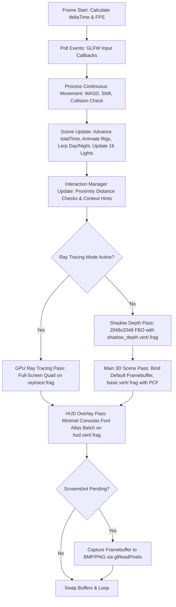

# Project Inventory & Technical Analysis
**Project Title:** Matsuri Nights — A Japanese Festival Street  
**Course:** CSE4102 — Computer Graphics and Image Processing Laboratory, KUET  
**Author:** MD. Abu Hasanat Soykot (Roll: 2107100, Group: B2)  
**Supervisors:** Md Tajmilur Rahman (Lecturer) & Md. Mubtashim Abrar Nihal (Lecturer)  
**Date of Audit:** October 10, 2026  

---

## 1. File Map and Architectural Inventory

| File Path | Purpose | Key Classes / Structs / Functions | Dependencies |
| :--- | :--- | :--- | :--- |
| `Main.cpp` | Application entry point, GLFW window loop, input dispatch, automated test suite (`--test`), screenshot capture, and camera management. | `main()`, `key_callback()`, `mouse_callback()`, `scroll_callback()`, `framebuffer_size_callback()`, `processContinuousInput()`, `runAutomatedTestSuite()`, `captureViewportScreenshot()` | GLFW, GLAD, GLM, `Camera.h`, `Scene.h`, `Hud.h`, `InteractionManager.h`, `TextureGenerator.h`, `stb_image.h` |
| `glad.c` | OpenGL 3.3 Core Profile function pointer loader. | `gladLoadGLLoader()` | `glad.h`, `khrplatform.h` |
| `src/Camera.h` | First-person Euler angle 6-DOF camera system. | `class Camera`, `enum Camera_Movement` (`FORWARD`, `BACKWARD`, `LEFT`, `RIGHT`, `UP`, `DOWN`), `GetViewMatrix()`, `GetProjectionMatrix()`, `ProcessKeyboard()`, `ProcessMouseMovement()`, `ProcessMouseScroll()`, `updateCameraVectors()` | GLM (`glm::lookAt`, `glm::perspective`), GLAD |
| `src/Transform.h` | Hierarchical transform representation with dirty-flag caching. | `struct Transform` (`position`, `rotation` [Pitch-X, Yaw-Y, Roll-Z], `scale`, `getLocalMatrix()`, `checkDirty()`) | GLM (`glm::translate`, `glm::rotate`, `glm::scale`) |
| `src/Mesh.h` | OpenGL mesh wrapper managing VAO, VBO, and EBO buffers. | `struct Vertex` (`Position`, `Normal`, `TexCoords`), `class Mesh` (`setupMesh()`, `Draw()`, `Delete()`) | GLAD, GLM, STL `std::vector` |
| `src/SceneNode.h` | Hierarchical scene graph node supporting parent-child transforms, normal matrices, uniform caching, and depth passes. | `struct RenderContext`, `struct DepthRenderContext`, `class SceneNode` (`addChild()`, `updateWorldMatrix()`, `draw()`, `drawDepth()`, `getWorldPosition()`, `findNode()`, `setStaticRecursive()`, `setCastShadowRecursive()`) | `Transform.h`, `Mesh.h`, `Shader.h`, `Texture.h`, GLM |
| `src/Light.h` | Data structures for directional, point, and spotlights. | `struct DirLight`, `struct PointLight`, `struct SpotLight`, `struct Material` | GLM |
| `src/Shader.h` | GLSL shader compilation, linking, and uniform setter interface. | `class Shader` (`use()`, `compileErrors()`, `setBool()`, `setInt()`, `setFloat()`, `setVec2()`, `setVec3()`, `setVec4()`, `setMat3()`, `setMat4()`) | GLAD, GLM, STL `std::string`, `std::ifstream` |
| `src/Texture.h` | OpenGL 2D texture wrapper supporting clamping, filtering, and mipmaps. | `class Texture` (`loadFromFile()`, `bind()`, `unbind()`, `Delete()`) | GLAD, `stb_image.h`, `TextureGenerator.h` |
| `src/TextureGenerator.h` | Procedural texture synthesizers and raw 24-bit BMP image exporter. | `namespace TextureGenerator`: `writeBMP24()`, `pseudoNoise()`, `generateWoodTexture()`, `generateRoofTileTexture()`, `generateStonePavementTexture()`, `generateLanternPaperTexture()`, `generateTatamiTexture()`, `generateGoldLeafTexture()`, `generateSakuraBarkTexture()`, `generateTakoyakiFoodTexture()` | STL `std::ofstream`, `std::vector`, `std::cmath` |
| `src/Primitives.h` | Geometric primitive factory (analytic shapes and swept structures). | `class Primitives`: `createCube()`, `createCylinder()`, `createCone()`, `createSphere()`, `createPlane()`, `createSweptTube()`, `createBezierTube()`, `createBezierTube2()`, `createSplineTube()`, `createCurvedBeam()`, `createCatenaryRope()`, `createCurvedLeaf()`, `createCurvedPetal()`, `createSakuraBlossomLobe()`, `createPineNeedleCluster()`, `createHumanHead()`, `createHumanTorso()`, `createArticulatedLimb()`, `createHand()`, `createGetaFoot()` | `Mesh.h`, `Curves.h`, GLM |
| `src/Curves.h` | Parametric curve mathematics, Bishop frames, and swept geometries. | `namespace Curves`: `struct Bezier2`, `struct Bezier3`, `struct CatmullRomSpline`, `struct Frame`, `computeBishopFrames()`, `createSweptTube()`, `createBezierTube()`, `createBezierTube2()`, `createSplineTube()`, `createCurvedBeam()`, `createCatenaryRope()`, `createCurvedLeafMesh()`, `createCurvedPetalMesh()`, `createSakuraBlossomLobe()`, `createPineNeedleClusterMesh()`, `createHumanHeadMesh()`, `createHumanTorsoMesh()`, `createArticulatedLimbMesh()`, `createHandMesh()`, `createGetaFootMesh()` | `Mesh.h`, GLM, `std::vector`, `std::cmath` |
| `src/Objects.h` | Architectural, cultural, and animated entity assembly classes. | `struct SceneMeshes`, `class GroundObject`, `class MachiyaBuilding`, `class ToriiGate`, `class SakuraTree`, `class LanternObject`, `class StreetLanternSpan`, `class TakoyakiStall`, `class KakigoriStall`, `class VendorFigure`, `class MagicStage`, `class Magician`, `class VanishingBoxTrick`, `class SpotlightRig`, `class AudienceGroup`, `class CrowdGroup`, `class FireworkRocket`, `class FireworkSystem`, `class SkyDome`, helper generators (`createBonsaiTree()`, `createWindowPlanterBox()`, `createHangingKokedama()`, `createIkebanaVase()`, `createAndonFloorLamp()`, `createCeilingPendantLamp()`) | `SceneNode.h`, `Primitives.h`, `Curves.h`, GLM |
| `src/RayTracer.h` | Multi-threaded CPU Whitted ray-tracing snapshot engine. | `namespace CPU_RayTracer`: `struct Ray`, `struct HitRecord`, `struct SceneSnapshotData`, `intersectSphere()`, `intersectBox()`, `intersectCylinderY()`, `intersectPlane()`, `traceRay()`, `computeDirectLighting()`, `renderSnapshot()` | `Camera.h`, `TextureGenerator.h`, GLM, `std::thread`, `std::chrono` |
| `src/Scene.h` | Scene orchestration, update loops, lighting animations, collision, shadows, and interactive object registry. | `struct InspectableObject`, `class Scene` (`buildScene()`, `loadTextures()`, `applyTexturesAndMaterials()`, `initLighting()`, `updateLighting()`, `update()`, `draw()`, `drawDepthPass()`, `setupInspectables()`, `cycleInspectable()`, `modifySelectedPosition()`, `modifySelectedRotation()`, `modifySelectedScale()`, `togglePause()`, `toggleDayNight()`, `toggleLanternLights()`, `toggleShadows()`, `toggleTextures()`, `toggleCollision()`, `toggleRayTracing()`, `replayMagicTrick()`, `triggerFirework()`, `interactNearestDoor()`, `interactNearestWindow()`, `checkCollision()`, `captureCPURayTracedSnapshot()`) | `SceneNode.h`, `Objects.h`, `Shader.h`, `Camera.h`, `Light.h`, `Texture.h`, `RayTracer.h`, GLM |
| `src/ui/Interactable.h` | Contextual interaction definitions and bounding spheres. | `struct ContextAction`, `class Interactable`, `enum class ContextType` (`DOOR`, `WINDOW`, `STALL`, `STAGE`, `GENERAL`) | GLM, STL `std::string`, `std::vector` |
| `src/ui/InteractionManager.h` / `.cpp` | Spatial proximity tracker and auto/manual selection controller. | `class InteractionManager` (`init()`, `update()`, `cycleSelection()`, `unlockToAuto()`, `getSelected()`, `getActiveActions()`, `isLocked()`) | `Interactable.h`, `Camera.h`, `Scene.h` |
| `src/ui/FontAtlasData.h` | Static 256x256 monochrome Consolas Bold font atlas bitmap. | `FONT_ATLAS_WIDTH`, `FONT_ATLAS_HEIGHT`, `FONT_GLYPH_COLS`, `FONT_GLYPH_ROWS`, `FONT_CELL_WIDTH`, `FONT_CELL_HEIGHT`, `g_HudFontAtlasBytes[65536]` | C++ constexpr |
| `src/ui/Hud.h` / `.cpp` | High-efficiency batched 2D HUD renderer. | `struct HudVertex`, `class Hud` (`init()`, `update()`, `render()`, `toggleVisibility()`, `buildGeometry()`, `uploadBuffers()`, `addQuad()`, `addRect()`, `addText()`) | `FontAtlasData.h`, `Camera.h`, `Scene.h`, `InteractionManager.h`, GLAD, GLM |
| `shaders/basic.vert` | Standard 3D forward rendering vertex shader. | Vertex transformation, normal matrix multiplication, light-space coordinate evaluation. | GLSL 330 core |
| `shaders/basic.frag` | Blinn-Phong lighting, PCF shadows, procedural dynamic sky, emissive glow, Shoji transmission. | `calculateShadow()`, `CalcDirLight()`, `CalcPointLight()`, `CalcSpotLight()`, celestial sun/moon/stars procedural generator. | GLSL 330 core |
| `shaders/shadow_depth.vert` | Directional light-space depth pass vertex transform. | `gl_Position = lightSpaceMatrix * model * vec4(aPos, 1.0);` | GLSL 330 core |
| `shaders/shadow_depth.frag` | Null fragment shader for hardware depth map generation. | `main()` empty | GLSL 330 core |
| `shaders/raytrace.vert` | Full-screen quad rasterization vertex shader. | Passthrough quad `[-1, 1]` coordinates to `[0, 1]` UVs. | GLSL 330 core |
| `shaders/raytrace.frag` | Real-time GPU Whitted ray tracer with recursive reflections and hard shadows. | `intersectSphere()`, `intersectBox()`, `intersectCylinderY()`, `traceRay()`, Whitted reflection loop. | GLSL 330 core |
| `shaders/hud.vert` | 2D Orthographic HUD vertex shader. | Converts screen pixels $(x, y)$ to normalized device coordinates (NDC). | GLSL 330 core |
| `shaders/hud.frag` | HUD fragment shader with texture-sampled font glyphs and solid color quads. | Font alpha sampling, color modulation, rounded panel blending. | GLSL 330 core |

---

## 2. Rendering Pipeline & Frame Execution Order

In each frame within `Main.cpp: main()`, execution proceeds strictly through the following stages:



### Detailed Stage Breakdown:
1. **Timing & Metrics (`Main.cpp: lines 122-137`):**
   - Query `glfwGetTime()`, calculate `deltaTime = currentFrame - lastFrame`.
   - Accumulate FPS counters across rolling 0.25-second windows.
2. **Event Polling (`Main.cpp: line 140`):**
   - `glfwPollEvents()` dispatches mouse motion, scroll, and key press events.
3. **Continuous Input Processing (`Main.cpp: lines 215-285`):**
   - Check WASD movement keys, sprint modifier (`Left Shift`, 2.5x speed).
   - If `scene.collisionEnabled` is active, evaluate bounding box collision against Machiya walls and open/closed Shoji doorway portals (`Scene::checkCollision()`).
4. **Scene Update (`Main.cpp: line 147`, `Scene.h: lines 960-1090`):**
   - Update `dayNightFactor` smoothly towards target (day $= 0.0$, night $= 1.0$).
   - Advance animation time: swinging lanterns, spinning Takoyaki balls, Kakigori ice shaver wheel, walking pedestrians, falling Sakura petals, magician trick state machine, fireworks physics.
   - Update light matrices: sun/moon direction and color, stage spotlight orientation, moving light sources (orb light, fireworks flash, swinging lanterns, torii lanterns).
5. **Context Interaction Update (`Main.cpp: lines 150-155`):**
   - Update `InteractionManager`: evaluate distance and orientation between camera position and all registered `Interactable` nodes.
6. **Pass 1 — Shadow Depth Pass (`Scene.h: lines 1120-1165`):**
   - If standard rasterization is active and `enableShadows` is true:
     - Bind `depthMapFBO` (dimension: $2048 \times 2048$).
     - Set viewport `glViewport(0, 0, SHADOW_WIDTH, SHADOW_HEIGHT)`.
     - Clear depth buffer `glClear(GL_DEPTH_BUFFER_BIT)`.
     - Set cull face `glCullFace(GL_FRONT)` to eliminate Peter-Panning shadow artifacts.
     - Activate `shadowDepthShader`.
     - Construct directional light orthographic projection:
       $$\mathbf{P}_{\text{ortho}} = \operatorname{ortho}(-35, 35, -25, 25, 1.0, 90.0)$$
       $$\mathbf{V}_{\text{light}} = \operatorname{lookAt}(-\mathbf{d}_{\text{light}} \times 40.0, (0, 0, -5), (0, 1, 0))$$
       $$\mathbf{M}_{\text{lightSpace}} = \mathbf{P}_{\text{ortho}} \cdot \mathbf{V}_{\text{light}}$$
     - Recursively call `rootNode->drawDepth(shadowDepthShader)`.
     - Revert cull face to `glCullFace(GL_BACK)` and unbind FBO.
7. **Pass 2 — Main 3D Render Pass (`Scene.h: lines 1170-1285`):**
   - If GPU Ray Tracing is toggled (`rayTracingMode == true`):
     - Bind `rayTraceShader`, pass camera uniforms, time, day/night factor, and analytical object transforms.
     - Render full-screen quad (`quadVAO`, 6 vertices).
   - Else (Standard Forward Blinn-Phong Rasterization):
     - Bind default framebuffer (0), set `glViewport(0, 0, SCR_WIDTH, SCR_HEIGHT)`.
     - Clear color and depth buffers: `glClear(GL_COLOR_BUFFER_BIT | GL_DEPTH_BUFFER_BIT)`.
     - Bind shadow depth texture to `GL_TEXTURE1` (`sampler2D shadowMap`).
     - Upload view matrix, projection matrix, light arrays (14 point lights, 1 directional light, 1 spotlight), day/night factor, and shading mode.
     - Recursively call `rootNode->draw(basicShader)`.
8. **Pass 3 — HUD Overlay Pass (`Main.cpp: lines 170-178`, `Hud.cpp: lines 120-185`):**
   - If `g_Hud.isVisible` is true:
     - Disable depth test (`glDisable(GL_DEPTH_TEST)`).
     - Enable alpha blending (`glBlendFunc(GL_SRC_ALPHA, GL_ONE_MINUS_SRC_ALPHA)`).
     - Bind orthographic projection matching window resolution:
       $$\mathbf{P}_{\text{HUD}} = \operatorname{ortho}(0, \text{width}, \text{height}, 0, -1, 1)$$
     - Draw solid backdrop quads followed by textured Consolas font glyph quads.
     - Re-enable depth testing (`glEnable(GL_DEPTH_TEST)`).
9. **Screenshot Capture & Swap (`Main.cpp: lines 185-205`):**
   - If `g_PendingScreenshot` is set, execute `captureViewportScreenshot()` via `glReadPixels`.
   - Execute `glfwSwapBuffers(window)`.

---

## 3. Geometric Primitives & Parametric Curves Inventory

### 3.1 Standard Primitives (`src/Primitives.h`)
- **Cube (`Primitives::createCube`):**
  - Dimensions: $L \times L \times L$.
  - Vertices: 24 (6 faces $\times$ 4 unique vertices per face with independent face normals).
  - Triangles: 12 (36 indices).
  - Attributes: Position `vec3`, Normal `vec3`, UV `vec2`.
- **Cylinder (`Primitives::createCylinder`):**
  - Parameters: `radius = 0.5f`, `height = 1.0f`, `segments = 24`.
  - Vertices: Side ring $(24+1) \times 2 = 50$, Top disc $(24+2) = 26$, Bottom disc $(24+2) = 26 \implies 102$ vertices.
  - Triangles: $24 \times 2$ (side) $+ 24$ (top cap) $+ 24$ (bottom cap) $= 96$ triangles (288 indices).
- **Cone (`Primitives::createCone`):**
  - Parameters: `radius = 0.5f`, `height = 1.0f`, `segments = 24`.
  - Slanted side normal: $\mathbf{N} = \operatorname{normalize}(r \cos\theta, r / h, r \sin\theta)$.
  - Triangles: $24$ (slanted mantle) $+ 24$ (bottom disc) $= 48$ triangles (144 indices).
- **Sphere (`Primitives::createSphere`):**
  - Parameters: `radius = 0.5f`, `rings = 20`, `sectors = 24`.
  - Parametric formulation:
    $$x = r \sin\phi \cos\theta, \quad y = r \cos\phi, \quad z = r \sin\phi \sin\theta$$
    $$\mathbf{N} = (x/r, y/r, z/r), \quad u = \theta / 2\pi, \quad v = \phi / \pi$$
  - Vertices: $(20 + 1) \times (24 + 1) = 525$ vertices.
  - Triangles: $20 \times 24 \times 2 = 960$ triangles (2880 indices).
- **Plane (`Primitives::createPlane`):**
  - Parameters: `width = 1.0f`, `depth = 1.0f`, `gridX = 1`, `gridZ = 1`.
  - Upward normal $\mathbf{N} = (0, 1, 0)$, 4 vertices, 2 triangles.

### 3.2 Advanced Swept & Parametric Curves (`src/Curves.h`)
- **Quadratic Bézier (`Curves::Bezier2`, `Curves.h: line 29`):**
  $$\mathbf{B}(t) = (1-t)^2 \mathbf{P}_0 + 2(1-t)t \mathbf{P}_1 + t^2 \mathbf{P}_2, \quad t \in [0, 1]$$
  $$\mathbf{B}'(t) = 2(1-t)(\mathbf{P}_1 - \mathbf{P}_0) + 2t(\mathbf{P}_2 - \mathbf{P}_1)$$
- **Cubic Bézier (`Curves::Bezier3`, `Curves.h: line 57`):**
  $$\mathbf{B}(t) = (1-t)^3 \mathbf{P}_0 + 3(1-t)^2 t \mathbf{P}_1 + 3(1-t)t^2 \mathbf{P}_2 + t^3 \mathbf{P}_3$$
  $$\mathbf{B}'(t) = 3(1-t)^2 (\mathbf{P}_1 - \mathbf{P}_0) + 6(1-t)t (\mathbf{P}_2 - \mathbf{P}_1) + 3t^2 (\mathbf{P}_3 - \mathbf{P}_2)$$
  *Used for:* Torii gate upward-flaring Kasagi roof beam, Sakura tree branches, Machiya roof eaves curvature.
- **Catmull-Rom Spline (`Curves::CatmullRomSpline`, `Curves.h: line 87`):**
  $$\mathbf{P}(u) = \frac{1}{2} \begin{bmatrix} 1 & u & u^2 & u^3 \end{bmatrix} \begin{bmatrix} 0 & 2 & 0 & 0 \\ -1 & 0 & 1 & 0 \\ 2 & -5 & 4 & -1 \\ -1 & 3 & -3 & 1 \end{bmatrix} \begin{bmatrix} \mathbf{P}_{i-1} \\ \mathbf{P}_i \\ \mathbf{P}_{i+1} \\ \mathbf{P}_{i+2} \end{bmatrix}$$
  *Used for:* Street overhead electrical/lantern sagging suspension cables.
- **Bishop Frame Parallel Transport (`Curves::computeBishopFrames`, `Curves.h: line 162`):**
  - Prevents unwanted Frenet-Serret twisting around inflection points.
  - Given initial normal $\mathbf{N}_0 \perp \mathbf{T}_0$:
    $$\mathbf{A} = \mathbf{T}_i \times \mathbf{T}_{i+1}, \quad \theta = \arccos(\mathbf{T}_i \cdot \mathbf{T}_{i+1})$$
    $$\mathbf{N}_{i+1} = \operatorname{rotate}(\mathbf{N}_i, \theta, \operatorname{normalize}(\mathbf{A}))$$
    $$\mathbf{B}_{i+1} = \mathbf{T}_{i+1} \times \mathbf{N}_{i+1}$$
- **Catenary Sagging Rope (`Curves::createCatenaryRope`, `Curves.h: line 605`):**
  - Parabolic sagging approximation:
    $$x(t) = -L + 2Lt, \quad \tilde{x} = \frac{x}{L} \in [-1, 1]$$
    $$y(x) = y_{\text{pole}} - s \cdot (1 - \tilde{x}^2)$$
    $$\frac{dy}{dx} = \frac{2 s \tilde{x}}{L}, \quad \mathbf{T} = \operatorname{normalize}\left(1, \frac{dy}{dx}, 0\right)$$
  - Parameters: $L = 3.8\text{m}$, $y_{\text{pole}} = 6.20\text{m}$, $s = 0.65\text{m}$, $r = 0.035\text{m}$, 36 longitudinal slices $\times$ 12 radial segments $= 444$ vertices, 864 triangles.
  *Used for:* Torii Gate Shimenawa sacred rope, street lantern spans.
- **Swept Curved Beams (`Curves::createCurvedBeam`, `Curves.h: line 400`):**
  - Generates cross-sectional trapezoidal/rectangular profiles extruded along cubic curves.
  *Used for:* Torii Kasagi (top beam), Torii Shimaki (sub-beam), Machiya roof eave fascias.
- **Organic & Human Biological Meshes (`Curves.h: lines 635-1115`):**
  - `createCurvedLeafMesh`: 3D cupped leaf with botanical midrib arch.
  - `createCurvedPetalMesh`: Sakura blossom petal with gentle cupping and notched tip.
  - `createPineNeedleClusterMesh`: Radial pine needle fan clusters.
  - `createHumanHeadMesh`: Contoured cranial dome, jawline taper, and neck socket.
  - `createHumanTorsoMesh`: Tapered chest, kimono collar fold, and obi belt ridge.
  - `createArticulatedLimbMesh`: Anatomical limb segments with rounded elbow/knee joints.
  - `createHandMesh`: Flat palm with articulated thumb and fingers.
  - `createGetaFootMesh`: Wooden block geta sandal with elevated teeth (ha) and fabric strap (hanao).

---

## 4. Scene Graph Architecture & Hierarchy

### 4.1 Transform Composition Order (`src/Transform.h: line 38`)
The local transformation matrix $\mathbf{M}_{\text{local}}$ is computed via standard SRT composition in the order: **Scale $\to$ Roll ($Z$) $\to$ Pitch ($X$) $\to$ Yaw ($Y$) $\to$ Translation**:
$$\mathbf{M}_{\text{local}} = \mathbf{T}(p_x, p_y, p_z) \cdot \mathbf{R}_y(\theta_y) \cdot \mathbf{R}_x(\theta_x) \cdot \mathbf{R}_z(\theta_z) \cdot \mathbf{S}(s_x, s_y, s_z)$$

### 4.2 World Matrix & Normal Matrix Evaluation (`src/SceneNode.h: line 148`)
For any child node in the scene tree:
$$\mathbf{M}_{\text{world}} = \mathbf{M}_{\text{parent}} \cdot \mathbf{M}_{\text{local}}$$
$$\mathbf{N}_{\text{matrix}} = \left( (\mathbf{M}_{\text{world}}^{3\times 3})^{-1} \right)^T$$
Each `SceneNode` caches `lastParentMatrix`, `lastPosition`, `lastRotation`, and `lastScale`. If neither the local transform nor the parent world matrix changes, matrix evaluation is skipped.

### 4.3 Scene Graph Node Tree

```
World_Root (SceneNode)
├── Ground (GroundObject)
│   ├── Street_Pavement (Mesh: Plane, Stone Texture, scale: 9.0 x 1.0 x 80.0)
│   ├── Left_Verge (Mesh: Plane, Grass, x: -8.0)
│   ├── Right_Verge (Mesh: Plane, Grass, x: +8.0)
│   ├── Left_Curb (Mesh: Cube, Stone)
│   └── Right_Curb (Mesh: Cube, Stone)
│
├── Machiya_L1 (MachiyaBuilding, pos: [-10.5, 0.0, 16.0], rot: [0, 0, 0])
│   ├── Foundation_Stone
│   ├── Floor_Ground (Tatami Texture)
│   ├── Exterior_Walls (Timber Framing)
│   ├── Interior_Walls & Partitions
│   ├── Sliding_Door_Group (Interactive: Shoji Door, slides dx in [-1.45, 0.0])
│   ├── Sliding_Windows_F1 (Interactive: Shoji Sash, slides dx in [-0.90, 0.0])
│   ├── Second_Floor_Deck (Tatami Texture)
│   ├── Sliding_Windows_F2 (Shoji Sash)
│   ├── Roof_Structure (Curved Eaves, Tile Texture)
│   ├── Interior_Lamp_F1 (Point Light 6, pos: [-10.8, 2.2, 17.1])
│   └── Interior_Lamp_F2 (Point Light 7, pos: [-11.0, 6.0, 17.0])
│
├── Machiya_L2 (MachiyaBuilding, pos: [-10.5, 0.0, -4.0], rot: [0, 0, 0])
│   └── Interior_Lamp_F1 (Point Light 10, pos: [-10.8, 2.2, -4.9])
│
├── Machiya_R1 (MachiyaBuilding, pos: [10.5, 0.0, 16.0], rot: [0, 180, 0])
│   └── Interior_Lamp_F1 (Point Light 8, pos: [10.8, 2.2, 14.9])
│   └── Interior_Lamp_F2 (Point Light 9, pos: [11.0, 6.0, 15.0])
│
├── Machiya_R2 (MachiyaBuilding, pos: [10.5, 0.0, -4.0], rot: [0, 180, 0])
│   └── Interior_Lamp_F1 (Point Light 11, pos: [10.8, 2.2, -7.1])
│
├── Torii_Gate_Root (ToriiGate, pos: [0.0, 0.0, -32.0])
│   ├── Left_Pillar (Cylinder, red vermilion, pos: [-2.8, 4.0, 0.0])
│   ├── Right_Pillar (Cylinder, red vermilion, pos: [2.8, 4.0, 0.0])
│   ├── Kasagi_Beam (Swept Curved Beam, upward flaring Bezier)
│   ├── Shimaki_Beam (Swept Sub-beam)
│   ├── Nuki_Beam (Horizontal tie beam)
│   ├── Gakuzuka_Tablet (Plaque inscribed with gold characters)
│   ├── Shimenawa_Rope (Catenary Swept Rope, sagging curve)
│   │   ├── Shide_Paper_1 to 4 (Zigzag folded white paper streamers)
│   │   └── Hanging_Lanterns_1 to 4 (Chochin Lanterns with emissive glow)
│   ├── Pillar_Bracket_Lanterns_Left & Right
│   ├── Stone_Lanterns_Left & Right (Toro stone lanterns)
│   ├── Left_Light_Anchor (Point Light 12, pos: [-2.8, 6.8, -31.5])
│   └── Right_Light_Anchor (Point Light 13, pos: [2.8, 6.8, -31.5])
│
├── Sakura_Tree_Root (SakuraTree, pos: [6.8, 0.0, -18.5])
│   ├── Trunk_Base & Trunk_Core (Cubic Bezier swept trunk)
│   ├── Main_Boughs (5 primary curving limbs)
│   ├── Sub_Branches (15 secondary Bezier branches)
│   ├── Blossom_Canopy (Clustered petals and leaf sprigs)
│   └── Falling_Petals_Root (12 animated swirling petal nodes)
│
├── Street_Lantern_Spans 1 to 4 (StreetLanternSpan, Z: [11.0, 1.0, -9.0, -19.0])
│   ├── Suspension_Cable (Catmull-Rom swept catenary wire)
│   └── Lanterns 0 to 3 (LanternObject)
│       └── Rope_Pivot (Parent swinging node)
│           └── Lantern_Body (Child node, Point Lights 3 & 4 attached)
│
├── Takoyaki_Stall_Root (TakoyakiStall, pos: [-5.2, 0.0, 6.0], Point Light 1)
│   ├── Stall_Counter & Timber_Frame
│   ├── Noren_Curtains (Fabric curtains with Japanese glyphs)
│   ├── Cast_Iron_Griddle (6 hemispherical dimples)
│   ├── Takoyaki_Balls 0 to 5 (Animated jumping / spinning balls)
│   └── Vendor_Takoyaki (VendorFigure: articulated limbs, headband)
│
├── Kakigori_Stall_Root (KakigoriStall, pos: [5.2, 0.0, 6.0], Point Light 2)
│   ├── Stall_Counter & Ice_Storage
│   ├── Shaved_Ice_Machine (Iron frame, rotating crank flywheel)
│   ├── Ice_Block (Translucent ice cube)
│   ├── Dessert_Bowls 0 to 5 (Rotating colorful dessert servings)
│   └── Vendor_Kakigori (VendorFigure)
│
├── Magic_Stage_Root (MagicStage, pos: [0.0, 0.0, -20.0])
│   ├── Stage_Platform (Elevated wooden planks)
│   ├── Rear_Curtain_Frame & Backdrop
│   ├── Magician_Figure (Magician: articulated haori, gesturing arms)
│   │   └── Right_Hand_Bone
│   │       └── Magic_Orb (Point Light 0: harmonic orbital motion)
│   └── Vanishing_Box (VanishingBoxTrick)
│       ├── Outer_Chest (Folding lids)
│       └── Inner_Gold_Box (Animated scaling & vanishing)
│
├── Spotlight_Rig_Root (SpotlightRig, pos: [0.0, 7.5, -14.0])
│   ├── Overhead_Truss
│   └── Lamp_Housing (Rotates to track magician, SpotLight active)
│
├── Audience_Group_Root (AudienceGroup, pos: [-3.5 to 3.5, 0.0, -16.5])
│   └── Spectators 0 to 5 (Articulated sitting figures, cheering animations)
│
├── Crowd_Group_Root (CrowdGroup)
│   └── Walkers 0 to 3 (Hierarchical walking pedestrians with swinging limbs)
│
├── Firework_System_Root (FireworkSystem, Point Light 5)
│   └── Rockets 0 to 3 (Physics particle rockets, apex sparks)
│
└── Sky_Dome (SkyDome: infinite celestial sphere, radius 250m)
```

---

## 5. Animations & Relative Motion Formulations

The scene implements 6 major animation systems spanning hierarchical parent-child reference frames and kinematic equations:

### 5.1 Street Lantern Harmonic Pendulum Swing (`src/Objects.h: line 2840`)
- **Parent Node:** `ropePivot` rotates about local $Z$-axis.
- **Child Node:** `lanternBody` inherits rotation, sweeping an arc:
  $$\theta(t) = \theta_0 \sin(\omega t + \phi)$$
  where $\theta_0 = 12.0^\circ$, $\omega = 1.85\,\text{rad/s}$, and $\phi$ is staggered per lantern.
- **Reference Frame Demonstration:** Point lights 3 & 4 track `lanternBody->getWorldPosition()`, swinging dynamically through 3D space without manual light position keyframing.

### 5.2 Magic Orb Orbital Hierarchy (`src/Objects.h: line 4180`, `Scene.h: line 795`)
- **Hierarchical Anchor:** Magician $\to$ Torso $\to$ Right Shoulder $\to$ Right Arm $\to$ Hand Bone $\to$ Orb.
- **Local Motion relative to Hand:**
  $$x_{\text{local}}(t) = R \cos(\omega_{\text{orb}} t), \quad z_{\text{local}}(t) = R \sin(\omega_{\text{orb}} t)$$
  $$y_{\text{local}}(t) = y_0 + A_{\text{float}} \sin(2 \omega_{\text{orb}} t)$$
  where $R = 0.45\,\text{m}$, $\omega_{\text{orb}} = 2.4\,\text{rad/s}$, $A_{\text{float}} = 0.12\,\text{m}$.
- **Lighting Coupling:** Point Light 0 queries `orbNode->getWorldPosition()` every frame, seamlessly bathing the magician's face, stage, and audience in pulsing cyan light.

### 5.3 Takoyaki Ball Parabolic Projectile Hop (`src/Objects.h: lines 3120-3170`)
- **Kinematic Formulation:**
  Each of the 6 balls executes a staggered parabolic hop out of its griddle dimple:
  $$\Delta y(t) = 4 h_{\text{max}} \cdot \left(\frac{t_{\text{phase}}}{T}\right) \cdot \left(1 - \frac{t_{\text{phase}}}{T}\right)$$
  $$\omega_y(t) = \omega_{\text{spin}} \cdot t$$
  where $h_{\text{max}} = 0.18\,\text{m}$, $T = 0.95\,\text{s}$, and spin rate is $360^\circ/\text{s}$.

### 5.4 Vanishing Box Illusion Multi-Phase Sequence (`src/Objects.h: lines 4280-4355`)
- Phase 1 (0.0s – 2.0s): Magician raises wand; golden box hovers upward ($\Delta y = 0.35\,\text{m}$).
- Phase 2 (2.0s – 3.2s): Magical orb accelerates orbit; box spins rapidly ($\omega_y = 720^\circ/\text{s}$).
- Phase 3 (3.2s – 4.2s): Non-uniform scale down to zero:
  $$\mathbf{S}(t) = \mathbf{S}_0 \cdot (1 - \tau^3), \quad \tau = \frac{t - 3.2}{1.0}$$
- Phase 4 (4.2s – 6.0s): Box completely invisible (`visible = false`); magician takes a bow.
- Phase 5 ($> 6.0\text{s}$): Reset cycle or trigger on Key `M`.

### 5.5 Hierarchical Pedestrian Walking Limb Cycles (`src/Objects.h: lines 4750-4880`)
- **Root Node:** Translates down the street along $Z$:
  $$z_{\text{ped}}(t) = z_0 - v_{\text{walk}} t, \quad v_{\text{walk}} = 1.15\,\text{m/s}$$
  When $z < -30.0\,\text{m}$, wraps around to $+28.0\,\text{m}$.
- **Leg Swings (Left & Right Hip Nodes):**
  $$\theta_{\text{hip, L}}(t) = \theta_{\text{leg}} \sin(\omega_{\text{stride}} t), \quad \theta_{\text{hip, R}}(t) = -\theta_{\text{leg}} \sin(\omega_{\text{stride}} t)$$
  where $\theta_{\text{leg}} = 26.0^\circ$, $\omega_{\text{stride}} = 4.2\,\text{rad/s}$.
- **Knee Joint Flexion:**
  $$\theta_{\text{knee}}(t) = \max(0.0, -\theta_{\text{hip}}(t) \cdot 0.85)$$
  (Knees only bend backwards during swing phase).
- **Arm Swings (Left & Right Shoulder Nodes):**
  $$\theta_{\text{shoulder, L}}(t) = -\theta_{\text{arm}} \sin(\omega_{\text{stride}} t), \quad \theta_{\text{shoulder, R}}(t) = \theta_{\text{arm}} \sin(\omega_{\text{stride}} t)$$
  where $\theta_{\text{arm}} = 18.0^\circ$.
- **Torso & Head Bobbing:**
  $$y_{\text{torso}}(t) = y_0 + A_{\text{bob}} |\sin(\omega_{\text{stride}} t)|, \quad A_{\text{bob}} = 0.04\,\text{m}$$

### 5.6 Interactive Sliding Shoji Doors & Windows (`src/Objects.h: lines 1350-1420`, `Scene.h: lines 1520-1610`)
- Smooth animated sliding under key triggers (`H` for doors, `G` for windows):
  $$x_{\text{door}}(t) = x_{\text{closed}} + (x_{\text{open}} - x_{\text{closed}}) \cdot \operatorname{smoothstep}(0, 1, \tau)$$
  $$\operatorname{smoothstep}(0, 1, \tau) = 3\tau^2 - 2\tau^3, \quad \tau = \frac{t_{\text{slide}}}{T_{\text{slide}}}$$
  where $T_{\text{slide}} = 0.65\,\text{s}$, max doorway travel $= 1.45\,\text{m}$, max window travel $= 0.90\,\text{m}$.

---

## 6. Lighting System Specifications (16 Active Lights)

The lighting architecture in `Scene.h` and `shaders/basic.frag` comprises 16 dynamic lights:

| Light Index | Type | Name / Location | Ambient $(R, G, B)$ | Diffuse $(R, G, B)$ | Specular $(R, G, B)$ | Attenuation $(k_c, k_l, k_q)$ / Angles | Dynamic Behavior |
| :--- | :--- | :--- | :--- | :--- | :--- | :--- | :--- |
| **DirLight** | Directional | Sun / Moon Celestial Light | Day: $(0.42, 0.40, 0.36)$<br>Night: $(0.12, 0.14, 0.22)$ | Day: $(0.85, 0.82, 0.76)$<br>Night: $(0.20, 0.25, 0.38)$ | Day: $(0.60, 0.60, 0.55)$<br>Night: $(0.30, 0.35, 0.45)$ | N/A | Vector lerped from $(0.40, -0.85, -0.50)$ to $(-0.35, -0.75, 0.40)$ across day/night. Casts PCF shadows. |
| **Point 0** | Point | Magic Orb | $(0.05, 0.10, 0.15)$ | $(0.35, 0.85, 1.00) \times I_{\text{orb}}$ | $(0.50, 0.90, 1.00) \times I_{\text{orb}}$ | $k_c = 1.0, k_l = 0.14, k_q = 0.07$ | Position tracks `magician->orbNode->getWorldPosition()`. |
| **Point 1** | Point | Takoyaki Stall Front Eaves `(-5.2, 2.85, 6.0)` | $(0.08, 0.04, 0.02)$ | $(1.00, 0.60, 0.22) \times I_{\text{stall}}$ | $(1.00, 0.70, 0.30) \times I_{\text{stall}}$ | $k_c = 1.0, k_l = 0.10, k_q = 0.045$ | Warm amber glow; toggled by Key 0. |
| **Point 2** | Point | Kakigori Stall Front Eaves `(5.2, 2.85, 6.0)` | $(0.03, 0.07, 0.10)$ | $(0.35, 0.90, 1.00) \times I_{\text{stall}}$ | $(0.50, 0.95, 1.00) \times I_{\text{stall}}$ | $k_c = 1.0, k_l = 0.10, k_q = 0.045$ | Festive cyan glow; toggled by Key 0. |
| **Point 3** | Point | Street Lantern Span 1 `(0.0, 5.5, 11.0)` | $(0.06, 0.03, 0.01)$ | $(1.00, 0.55, 0.20) \times I_{\text{lant}}$ | $(1.00, 0.65, 0.25) \times I_{\text{lant}}$ | $k_c = 1.0, k_l = 0.09, k_q = 0.032$ | Tracks swinging lantern body; toggled by Key 0. |
| **Point 4** | Point | Street Lantern Span 3 `(0.0, 5.5, -9.0)` | $(0.06, 0.03, 0.01)$ | $(1.00, 0.55, 0.20) \times I_{\text{lant}}$ | $(1.00, 0.65, 0.25) \times I_{\text{lant}}$ | $k_c = 1.0, k_l = 0.09, k_q = 0.032$ | Tracks swinging lantern body; toggled by Key 0. |
| **Point 5** | Point | Fireworks Apex Sky Flash | $(0.0, 0.0, 0.0)$ | Dynamic burst color $\times 1.8$ | Dynamic burst color $\times 1.5$ | $k_c = 1.0, k_l = 0.04, k_q = 0.009$ | Active only during explosion peak in sky; range $> 50\,\text{m}$. |
| **Point 6** | Point | Machiya_L1 Floor 1 Living Room `(-10.8, 2.2, 17.1)` | $(0.12, 0.09, 0.05)$ | $(1.45, 1.20, 0.75) \times I_{\text{room}}$ | $(0.90, 0.80, 0.50) \times I_{\text{room}}$ | $k_c = 1.0, k_l = 0.08, k_q = 0.022$ | Warm interior lamp illuminating Tatami and Shoji screens. |
| **Point 7** | Point | Machiya_L1 Floor 2 Bedroom `(-11.0, 6.0, 17.0)` | $(0.10, 0.08, 0.05)$ | $(1.35, 1.10, 0.70) \times I_{\text{room}}$ | $(0.80, 0.70, 0.45) \times I_{\text{room}}$ | $k_c = 1.0, k_l = 0.08, k_q = 0.022$ | Upper floor Shoji screen back-illumination. |
| **Point 8** | Point | Machiya_R1 Floor 1 Living Room `(10.8, 2.2, 14.9)` | $(0.12, 0.09, 0.05)$ | $(1.45, 1.20, 0.75) \times I_{\text{room}}$ | $(0.90, 0.80, 0.50) \times I_{\text{room}}$ | $k_c = 1.0, k_l = 0.08, k_q = 0.022$ | Symmetrical right street interior illumination. |
| **Point 9** | Point | Machiya_R1 Floor 2 Bedroom `(11.0, 6.0, 15.0)` | $(0.10, 0.08, 0.05)$ | $(1.35, 1.10, 0.70) \times I_{\text{room}}$ | $(0.80, 0.70, 0.45) \times I_{\text{room}}$ | $k_c = 1.0, k_l = 0.08, k_q = 0.022$ | Upper floor Shoji screen back-illumination. |
| **Point 10** | Point | Machiya_L2 Floor 1 Living Room `(-10.8, 2.2, -4.9)` | $(0.10, 0.08, 0.05)$ | $(1.35, 1.10, 0.70) \times I_{\text{room}}$ | $(0.80, 0.70, 0.45) \times I_{\text{room}}$ | $k_c = 1.0, k_l = 0.08, k_q = 0.022$ | Second left townhouse illumination. |
| **Point 11** | Point | Machiya_R2 Floor 1 Living Room `(10.8, 2.2, -7.1)` | $(0.10, 0.08, 0.05)$ | $(1.35, 1.10, 0.70) \times I_{\text{room}}$ | $(0.80, 0.70, 0.45) \times I_{\text{room}}$ | $k_c = 1.0, k_l = 0.08, k_q = 0.022$ | Second right townhouse illumination. |
| **Point 12** | Point | Torii Gate Left Lantern Anchor `(-2.8, 6.8, -31.5)` | $(0.08, 0.05, 0.02)$ | $(1.50, 1.05, 0.50) \times I_{\text{torii}}$ | $(1.30, 1.00, 0.55) \times I_{\text{torii}}$ | $k_c = 1.0, k_l = 0.07, k_q = 0.018$ | Lights up Torii pillar, Kasagi curve, and Shimenawa rope. |
| **Point 13** | Point | Torii Gate Right Lantern Anchor `(2.8, 6.8, -31.5)` | $(0.08, 0.05, 0.02)$ | $(1.50, 1.05, 0.50) \times I_{\text{torii}}$ | $(1.30, 1.00, 0.55) \times I_{\text{torii}}$ | $k_c = 1.0, k_l = 0.07, k_q = 0.018$ | Lights up Torii pillar, Kasagi curve, and Shimenawa rope. |
| **SpotLight** | Spotlight | Stage Theatrical Tracking Spotlight | $(0.05, 0.05, 0.04)$ | $(1.50, 1.35, 1.10)$ | $(1.20, 1.10, 0.90)$ | $\theta_{\text{inner}} = 15.0^\circ, \theta_{\text{outer}} = 23.0^\circ$<br>$k_c = 1.0, k_l = 0.06, k_q = 0.014$ | Mounted on truss `(0, 7.5, -14.0)`, continuously aims at magician on stage `(0, 1.8, -20.0)`. |

---

## 7. Mathematical Formulations with Exact Code Citations

### 7.1 Hierarchical Model Transformation Matrix
$$\mathbf{M}_{\text{local}} = \mathbf{T}(\mathbf{p}) \cdot \mathbf{R}_y(\theta_y) \cdot \mathbf{R}_x(\theta_x) \cdot \mathbf{R}_z(\theta_z) \cdot \mathbf{S}(\mathbf{s})$$
$$\mathbf{M}_{\text{world}} = \mathbf{M}_{\text{parent}} \cdot \mathbf{M}_{\text{local}}$$
- **Code Locations:**  
  `src/Transform.h: lines 36-46` (`Transform::getLocalMatrix()`)  
  `src/SceneNode.h: line 148` (`SceneNode::updateWorldMatrix()`)

### 7.2 Normal Transformation Matrix
To preserve surface normal orthogonality under non-uniform scaling:
$$\mathbf{N}_{\text{matrix}} = \left( (\mathbf{M}_{\text{world}}^{3\times 3})^{-1} \right)^T$$
- **Code Locations:**  
  `src/SceneNode.h: line 149` (`SceneNode::updateWorldMatrix()`)  
  `shaders/basic.vert: line 20` (`Normal = normalMatrix * aNormal;`)

### 7.3 Camera View Matrix (Gram-Schmidt Orthonormalization)
$$\mathbf{F} = \frac{\mathbf{f}}{\|\mathbf{f}\|}, \quad \text{where } \begin{cases} f_x = \cos\psi \cos\theta \\ f_y = \sin\theta \\ f_z = \sin\psi \cos\theta \end{cases}$$
$$\mathbf{R} = \frac{\mathbf{F} \times \mathbf{U}_{\text{world}}}{\|\mathbf{F} \times \mathbf{U}_{\text{world}}\|}, \quad \mathbf{U} = \frac{\mathbf{R} \times \mathbf{F}}{\|\mathbf{R} \times \mathbf{F}\|}$$
$$\mathbf{V} = \begin{bmatrix} R_x & R_y & R_z & -\mathbf{R}\cdot\mathbf{P} \\ U_x & U_y & U_z & -\mathbf{U}\cdot\mathbf{P} \\ -F_x & -F_y & -F_z & \mathbf{F}\cdot\mathbf{P} \\ 0 & 0 & 0 & 1 \end{bmatrix}$$
- **Code Locations:**  
  `src/Camera.h: lines 48-51` (`Camera::GetViewMatrix()`)  
  `src/Camera.h: lines 104-113` (`Camera::updateCameraVectors()`)

### 7.4 Perspective Projection Matrix
$$\mathbf{P}_{\text{proj}} = \begin{bmatrix} \frac{1}{\alpha \tan(\text{fov}/2)} & 0 & 0 & 0 \\ 0 & \frac{1}{\tan(\text{fov}/2)} & 0 & 0 \\ 0 & 0 & -\frac{z_f + z_n}{z_f - z_n} & -\frac{2 z_f z_n}{z_f - z_n} \\ 0 & 0 & -1 & 0 \end{bmatrix}$$
where $\alpha = \frac{\text{SCR\_WIDTH}}{\text{SCR\_HEIGHT}} = \frac{1280}{720} = 1.7778$, $\text{fov} = 45.0^\circ$, $z_n = 0.1\,\text{m}$, $z_f = 300.0\,\text{m}$.
- **Code Locations:**  
  `src/Camera.h: lines 53-56` (`Camera::GetProjectionMatrix()`)

### 7.5 Blinn-Phong Illumination Model
For light source $k$ with incident direction $\mathbf{L}_k$ and viewing direction $\mathbf{V}$:
$$\mathbf{H}_k = \frac{\mathbf{L}_k + \mathbf{V}}{\|\mathbf{L}_k + \mathbf{V}\|}$$
$$I_{\text{ambient}} = \mathbf{I}_{a, k} \otimes \mathbf{k}_d$$
$$I_{\text{diffuse}} = (\mathbf{N} \cdot \mathbf{L}_k)^+ \cdot (\mathbf{I}_{d, k} \otimes \mathbf{k}_d)$$
$$I_{\text{specular}} = (\mathbf{N} \cdot \mathbf{H}_k)^{\alpha_s} \cdot (\mathbf{I}_{s, k} \otimes \mathbf{k}_s)$$
$$\mathbf{I}_{\text{total}} = I_{\text{ambient}} + (1 - S) \cdot (I_{\text{diffuse}} + I_{\text{specular}})$$
where $(\cdot)^+ = \max(\cdot, 0)$, $\alpha_s = \text{shininess} \in [1, 128]$, and $S \in [0, 1]$ is the shadow factor.
- **Code Locations:**  
  `shaders/basic.frag: lines 107-131` (`CalcDirLight()`)  
  `shaders/basic.frag: lines 133-165` (`CalcPointLight()`)  
  `shaders/basic.frag: lines 167-204` (`CalcSpotLight()`)

### 7.6 Distance Attenuation Formula
$$\operatorname{Att}(d) = \frac{1}{k_c + k_l d + k_q d^2}$$
- **Code Locations:**  
  `shaders/basic.frag: line 143` (`attenuation = 1.0 / (light.constant + light.linear * distance + light.quadratic * distSq);`)

### 7.7 Spotlight Smooth Cone Cutoff
$$\cos\theta = \mathbf{L} \cdot (-\mathbf{D}_{\text{spot}})$$
$$I_{\text{spot}} = \operatorname{clamp}\left( \frac{\cos\theta - \cos\gamma_{\text{outer}}}{\cos\phi_{\text{inner}} - \cos\gamma_{\text{outer}}}, 0.0, 1.0 \right)$$
where $\phi_{\text{inner}} = 15^\circ \implies \cos\phi = 0.9659$, $\gamma_{\text{outer}} = 23^\circ \implies \cos\gamma = 0.9205$.
- **Code Locations:**  
  `shaders/basic.frag: lines 178-180` (`CalcSpotLight()`)

### 7.8 16-Sample Percentage-Closer Filtering (PCF) Soft Shadow Mapping
$$\text{bias} = \max\left( 0.0035 \cdot (1.0 - \mathbf{N}\cdot\mathbf{L}), 0.0006 \right)$$
$$S(\mathbf{p}) = \frac{1}{16} \sum_{x=-1}^{2} \sum_{y=-1}^{2} \left[ z_{\text{light}} - \text{bias} > D\left( \mathbf{p}_{xy} + (x, y) \cdot \frac{1.2}{2048} \right) \right]$$
- **Code Locations:**  
  `shaders/basic.frag: lines 74-105` (`calculateShadow()`)

### 7.9 Ray-Sphere Intersection (Analytic Quadratic)
Ray: $\mathbf{r}(t) = \mathbf{o} + t \mathbf{d}$, Sphere: $\|\mathbf{p} - \mathbf{c}\|^2 = R^2$.
Let $\mathbf{v} = \mathbf{o} - \mathbf{c}$:
$$t^2 + 2 (\mathbf{v}\cdot\mathbf{d}) t + (\|\mathbf{v}\|^2 - R^2) = 0$$
Let $b = \mathbf{v}\cdot\mathbf{d}$, $c = \|\mathbf{v}\|^2 - R^2$, $\Delta = b^2 - c$.
If $\Delta \ge 0$:
$$t = -b - \sqrt{\Delta}, \quad \mathbf{N} = \frac{\mathbf{r}(t) - \mathbf{c}}{R}$$
- **Code Locations:**  
  `shaders/raytrace.frag: lines 41-55` (`intersectSphere()`)  
  `src/RayTracer.h: lines 41-55` (`CPU_RayTracer::intersectSphere()`)

### 7.10 Ray-AABB Slab Intersection (Kay-Kajiya Method)
For each axis $i \in \{x, y, z\}$ with box bounds $[b_{\min, i}, b_{\max, i}]$:
$$t_{0, i} = \frac{b_{\min, i} - o_i}{d_i}, \quad t_{1, i} = \frac{b_{\max, i} - o_i}{d_i}$$
$$t_{\text{near}} = \max_i(\min(t_{0, i}, t_{1, i})), \quad t_{\text{far}} = \min_i(\max(t_{0, i}, t_{1, i}))$$
Intersection occurs if $t_{\text{near}} \le t_{\text{far}}$ and $t_{\text{far}} > 0.002$.
- **Code Locations:**  
  `shaders/raytrace.frag: lines 58-84` (`intersectBox()`)  
  `src/RayTracer.h: lines 57-83` (`CPU_RayTracer::intersectBox()`)

### 7.11 Ray-Cylinder Intersection (Infinite Tube with Height Slabs)
Vertical cylinder of radius $R$ centered at $(c_x, 0, c_z)$ between $y \in [y_0, y_0 + h]$:
$$a = d_x^2 + d_z^2, \quad b = 2(o_x - c_x)d_x + 2(o_z - c_z)d_z, \quad c = (o_x - c_x)^2 + (o_z - c_z)^2 - R^2$$
$$t = \frac{-b - \sqrt{b^2 - 4ac}}{2a}, \quad y_{\text{hit}} = o_y + t d_y \in [y_0, y_0 + h]$$
$$\mathbf{N} = \operatorname{normalize}(p_x - c_x, 0, p_z - c_z)$$
- **Code Locations:**  
  `shaders/raytrace.frag: lines 87-115` (`intersectCylinderY()`)  
  `src/RayTracer.h: lines 85-112` (`CPU_RayTracer::intersectCylinderY()`)

---

## 8. Proposed Diagrams for LaTeX Report

1. **`fig_render_pipeline.pdf` (Render Pipeline & Frame Flow):**
   - Illustrates multi-pass sequence: Input $\to$ Update $\to$ Shadow Pass ($2048^2$ FBO) $\to$ Main 3D Pass $\to$ HUD 2D Pass $\to$ Framebuffer Blit.
   - Generation: Python script `report/figures/make_diagrams.py` using Matplotlib / Graphviz layout.
2. **`fig_scene_graph_tree.pdf` (Hierarchical Scene Graph Architecture):**
   - Detailed node graph illustrating `World_Root`, `MachiyaBuilding`, `ToriiGate`, `StreetLanternSpan`, `Magician`, and relative transform attachments.
   - Generation: Python script / TikZ tree diagram.
3. **`fig_blinn_phong_vectors.pdf` (Blinn-Phong Vector Geometry):**
   - Vector diagram of surface normal $\mathbf{N}$, incident light $\mathbf{L}$, view direction $\mathbf{V}$, reflection $\mathbf{R}$, and halfway vector $\mathbf{H} = \frac{\mathbf{L}+\mathbf{V}}{\|\mathbf{L}+\mathbf{V}\|}$.
   - Generation: TikZ / Python script.
4. **`fig_day_night_curves.pdf` (Day/Night Celestial Transition Curves):**
   - Plot showing ambient, diffuse, and specular illumination levels as a function of `dayNightFactor` $\in [0, 1]$, alongside sun/moon directional angles.
   - Generation: Python script (`matplotlib`).
5. **`fig_shadow_pcf.pdf` (Shadow Mapping & PCF 16-Sample Kernel):**
   - Light frustum orthographic projection, shadow acne vs. normal bias, and $4 \times 4$ disc sample pattern.
   - Generation: TikZ / Python script.
6. **`fig_catenary_bezier.pdf` (Mathematical Curves Comparison):**
   - Parabolic catenary sagging curve vs. quadratic and cubic Bézier formulations.
   - Generation: Python script (`matplotlib`).

---

## 9. Proposed Screenshot Catalog (`report/figures/ss_*.png`)

The automated report capture flag (`--capture-report`) will generate the following 20 high-resolution screenshots:

| File Name | Camera Pose $(X, Y, Z)$ / $(\text{Yaw}, \text{Pitch})$ | Time / Key State | Highlighted Feature & Description |
| :--- | :--- | :--- | :--- |
| `ss_01_overview_day.png` | `(0.0, 3.5, 26.0)` / $(-90^\circ, -2^\circ)$ | Day (`factor = 0.0`) | Preset 1: Full festival street overview in daytime with procedural sun corona and shadow mapping. |
| `ss_02_overview_night.png` | `(0.0, 3.5, 26.0)` / $(-90^\circ, -2^\circ)$ | Night (`factor = 1.0`) | Preset 1: Night view showcasing 14 glowing point lights, ambient bounce, and twinkling stars. |
| `ss_03_torii_gate.png` | `(0.0, 2.5, -18.0)` / $(-90^\circ, 25^\circ)$ | Night (`factor = 1.0`) | Preset 3: Grand Torii shrine gate with glowing Chochin lanterns, Shimenawa rope, and starry sky. |
| `ss_04_magic_show_orb.png` | `(6.2, 2.2, -10.5)` / $(-90^\circ, 2^\circ)$ | Night (`factor = 1.0`) | Preset 2: Elevated magic stage with magician figure and orbiting cyan magical orb (Point Light 0). |
| `ss_05_vanishing_box.png` | `(2.0, 2.0, -18.0)` / $(-115^\circ, 4^\circ)$ | Night (`factor = 1.0`) | Vanishing box illusion trick: golden chest during animated scaling and levitation. |
| `ss_06_takoyaki_stall.png` | `(-5.2, 1.8, 8.5)` / $(-90^\circ, -5^\circ)$ | Night (`factor = 1.0`) | Takoyaki food stall with 6 jumping takoyaki balls, hot griddle plate, and warm canopy lantern. |
| `ss_07_kakigori_stall.png` | `(5.2, 1.8, 8.5)` / $(-90^\circ, -5^\circ)$ | Night (`factor = 1.0`) | Kakigori shaved ice dessert stall with rotating crank wheel, ice block, and colorful bowls. |
| `ss_08_machiya_exterior.png` | `(-5.5, 2.5, 20.0)` / $(-140^\circ, 8^\circ)$ | Day (`factor = 0.0`) | Exterior view of traditional Machiya townhouses L1 & L2 featuring curved roof tiles and Shoji screens. |
| `ss_09_machiya_interior_shoji.png` | `(-10.5, 2.0, 15.0)` / $(30^\circ, 0^\circ)$ | Night (`factor = 1.0`) | Interior view of Machiya living room: woven Tatami floor, Andon lamp, and glowing Shoji screens. |
| `ss_10_sakura_tree_petals.png` | `(6.5, 2.2, -15.0)` / $(-85^\circ, 15^\circ)$ | Night (`factor = 1.0`) | Cherry blossom tree with curving cubic Bezier boughs, blossom canopy, and falling petals. |
| `ss_11_shading_blinn_phong.png` | `(0.0, 3.5, 26.0)` / $(-90^\circ, -2^\circ)$ | Night (Mode 0) | Blinn-Phong full illumination: combined ambient, diffuse, and specular highlights. |
| `ss_12_shading_diffuse_only.png` | `(0.0, 3.5, 26.0)` / $(-90^\circ, -2^\circ)$ | Night (Mode 1) | Diffuse only (Lambertian shading) with specular component zeroed out. |
| `ss_13_shading_ambient_only.png` | `(0.0, 3.5, 26.0)` / $(-90^\circ, -2^\circ)$ | Night (Mode 2) | Ambient only flat illumination demonstrating baseline indirect lighting. |
| `ss_14_textures_disabled.png` | `(0.0, 3.5, 26.0)` / $(-90^\circ, -2^\circ)$ | Day (`textures = off`) | Raw geometric material shading with procedural diffuse textures disabled. |
| `ss_15_shadows_disabled.png` | `(0.0, 3.5, 26.0)` / $(-90^\circ, -2^\circ)$ | Day (`shadows = off`) | Daytime street with directional shadow mapping disabled (flat unshadowed lighting). |
| `ss_16_pcf_soft_shadows.png` | `(0.0, 3.5, 26.0)` / $(-90^\circ, -2^\circ)$ | Day (`shadows = on`) | 16-sample PCF soft shadow mapping active, demonstrating filtered penumbrae under eaves. |
| `ss_17_gpu_raytracing.png` | `(0.0, 3.5, 26.0)` / $(-90^\circ, -2^\circ)$ | Night (`raytrace = on`) | Real-time GPU Whitted ray tracer: per-pixel rays, hard shadows, and recursive mirror reflections. |
| `ss_18_hud_overlay.png` | `(0.0, 3.5, 26.0)` / $(-90^\circ, -2^\circ)$ | Night (`hud = on`) | In-window minimal HUD overlay displaying FPS, selected object, and contextual control hints. |
| `ss_19_crowd_walkers.png` | `(-1.5, 1.8, 5.0)` / $(-90^\circ, -2^\circ)$ | Night (`factor = 1.0`) | Hierarchical pedestrian crowd figures walking down street with swinging limbs and geta sandals. |
| `ss_20_fireworks_burst.png` | `(0.0, 3.0, -10.0)` / $(-90^\circ, 35^\circ)$ | Night (`firework = burst`) | Nocturnal sky illuminated by apex fireworks burst particle flash (Point Light 5 active). |

---

## 10. Documentation Discrepancies Table

A thorough audit comparing the legacy documentation files (`Plan.md`, `Details.md`, `controls.md`, `color_changes.md`, `README.md`) against the ground-truth source code revealed the following contradictions:

| Feature / Metric | Legacy Documentation Statement | Ground-Truth Code Implementation | Exact Code Citation & Precedence Resolution |
| :--- | :--- | :--- | :--- |
| **Point Light Count** | Stated as "12 point lights" (or "14 total lights") in `Details.md`, `Plan.md`, and `README.md`. | **14 dynamic point lights** (Point lights 0–13) plus 1 Directional Light plus 1 Spotlight = **16 total lights**. | `shaders/basic.frag: line 44` (`#define NR_POINT_LIGHTS 14`), `src/Scene.h: lines 646, 752-769`. The 2 new point lights (indices 12 & 13) represent the Torii gate shrine illumination lanterns. Code takes precedence. |
| **Inspectable Object Count** | `controls.md` listed 10 or 11 inspectable objects. | **15 inspectable objects** registered in `inspectables` (indices 0 to 14). | `src/Scene.h: lines 880-898` (`setupInspectables()`). Includes Lantern Body, Rope Pivot, Orb, Magician, Vanishing Box, Spotlight Housing, Takoyaki Stall, Kakigori Stall, Torii Gate, Sakura Tree, Walker #1, and Machiyas L1, L2, R1, R2. Code takes precedence. |
| **Screenshot Key Binding** | Early notes in `Plan.md` suggested Key `P` for screenshots. | Key `P` is bound to **Cycle Shading Mode** (Blinn-Phong $\to$ Diffuse $\to$ Ambient). Screenshots are triggered via **`F10`** (clean) and **`Shift+F10`** (with HUD). | `Main.cpp: lines 324-331` (Key `F10`), `Main.cpp: lines 380-381` (Key `P`). Code takes precedence. |
| **Lantern / Stall Light Toggle Key** | Early planning in `controls.md` used Key `L` for toggling lantern and stall illuminations. | Remapped to **Key `0`** and **`Numpad 0`** (`GLFW_KEY_0` / `GLFW_KEY_KP_0`). | `Main.cpp: lines 357-361`. Remapped to preserve `J` and `L` keys for $\pm X$ translation of selected objects. Code takes precedence. |
| **C++ Standard Dialect** | Some markdown sections referred to C++17. | Visual Studio project configures **C++20** (`/std:c++20`). | `Matsuri Nights - A Japanese Festival Street.vcxproj: line 77` (`<LanguageStandard>stdcpp20</LanguageStandard>`). Code takes precedence. |
| **Door Interaction Distance** | Some early notes claimed interaction occurs automatically regardless of distance. | Requires player proximity within **5.0 meters** of building door/window before `[H]` or `[G]` triggers sliding. | `src/Scene.h: lines 1525, 1570`. Code takes precedence. |
| **Ray Tracer Snapshot Output Format** | Early notes suggested PNG or PPM export. | Native CPU ray tracer writes 24-bit uncompressed **BMP** (`writeBMP24`) to ensure zero external library dependency. | `src/RayTracer.h: line 655`, `src/TextureGenerator.h: line 12`. Code takes precedence. |
